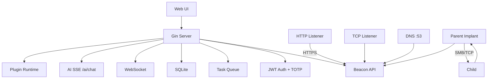

# ForgeC2

[English](./README.md) | [中文](./README.zh.md)

**Professional C2 Framework for Authorized Red Team Operations**

ForgeC2 is a modern, single-binary command-and-control framework written in pure Go. It ships with a full web console, multi-transport beaconing, an AI assistant, plugin system, and 50+ implant task types — built for authorized red team engagements and security research.

**v2.0.0** — i18n · Plugin System · AI Persistence · Real-time Shell · JS Bundles · OpenAPI · TOTP · Encrypted Backups

---

## Highlights (v2.0.0)

| Area | What's New |
|------|------------|
| **AI Assistant** | Full-page UI, SSE streaming, reasoning panel, localStorage persistence across page navigation, async implant commands (no beacon wait) |
| **Shell** | Real-time mode for 0s heartbeat, UTF-8 output fix, compact toolbar |
| **Web UI** | 13 JS bundles, dark mode, global search, notification center, agent online toasts, virtual lists |
| **i18n** | English, 中文, 日本語, 한국어, العربية (RTL) |
| **Plugins** | Manifest-based Python/Go plugins with UI management |
| **Security** | TOTP 2FA, rate limiting, encrypted DB backups, config hot-reload |
| **API** | OpenAPI 3.0 spec at `/api/docs` |

---

## Features

### AI Assistant
- **Models**: DeepSeek, OpenAI, Claude, Qianwen, custom OpenAI-compatible endpoints
- **Function calling**: list agents, run commands, query tasks, credentials, listeners, operators
- **Streaming**: SSE with markdown rendering, reasoning display, tool-call visibility
- **Persistence**: chat history + in-progress drafts survive page switches
- **Safety**: response length cap, tool deduplication, consecutive call limits

### C2 Core
- **Transports**: HTTP(S), TCP, DNS, ICMP
- **P2P chaining**: SMB named pipes / TCP relay
- **Malleable profiles**: 15+ presets (bing, google, office365, teams, …)
- **Multi-listener**: independent host/port/profile per listener
- **Sleep + jitter**: per-implant, supports 0s real-time mode

### Implant Capabilities

| Category | Tasks |
|----------|-------|
| Shell & System | `shell`, `ps`, `killproc`, `suspend`, `resume`, `reboot` |
| Credentials | `creds`, `mimikatz`, `kerberoast`, `dcsync`, auto-vault |
| Lateral Movement | WMI, WinRM, PsExec, Pass-the-Hash, Pass-the-Ticket |
| Token Ops | steal, make, revert, whoami |
| Execution | execute-assembly, BOF, PowerPick, PE Loader |
| Persistence | Registry, schtasks, Startup, WMI, Service, COM hijack |
| Surveillance | screenshot, keylogger, live screen stream |
| Network | SOCKS5 relay, portscan, reverse port forward |

### Web Console
- Dashboard with charts, heatmaps, geo map, attack-path view
- 3-state implant status (online / stale / offline)
- Implant detail: tabs, port forward, task history, current window title
- Shell, files, screen monitor, toolkit (40+ commands)
- Generate page: cross-platform builds, shared listener, malleable profile lock
- Global search, operator chat, audit log CSV export
- Collapsible sidebar, online users panel, keyboard shortcuts

### Plugins
- Drop-in plugins under `plugins/` with `manifest.yaml`
- Python / Go interpreters, timeout control, agent-side execution
- Web UI: install, enable/disable, execute, import/export, reviews

### Security
- JWT + bcrypt, HttpOnly session cookies, CSRF protection
- TOTP two-factor authentication with backup codes
- Per-route rate limiting (login, API, beacon)
- Audit logging, path traversal prevention
- Passwords never rendered in HTML DOM
- AES-GCM encrypted automatic database backups

---

## Quick Start

```bash
git clone https://github.com/Ruka-afk/forgec2.git
cd forgec2
go mod tidy
go build -o forgec2-server ./cmd/server
./forgec2-server -config config/config.yaml
```

Open **http://localhost:8080** — default credentials: `admin` / `admin`

> Copy `config/config.yaml` to `config.yaml` in the project root, or pass `-config` explicitly. On first run the server creates `data/` automatically.

### Windows Build

```powershell
go build -o server.exe ./cmd/server
.\server.exe -config config.yaml
```

### Frontend Asset Build (optional)

Templates embed JS/CSS via `go:embed`. After editing files under `internal/server/templates/static/`, rebuild bundles:

```powershell
powershell -ExecutionPolicy Bypass -File .\build_js.ps1 -SkipCSS
go build -o server.exe ./cmd/server
```

---

## Configuration

Key sections in `config.yaml`:

```yaml
server:
  port: 8080
  offline_threshold: 60      # seconds before "stale"
implant:
  default_interval: 0        # 0 = real-time shell mode
  default_jitter: 20
ai:
  enabled: true
  provider: deepseek
  api_key: "sk-..."
  model: deepseek-chat
rate_limit:
  login:
    max_attempts: 5
    lockout_time: 900
```

See `config/config.yaml` for the full reference template.

---

## AI Assistant Setup

1. Open **AI Assistant** in the sidebar
2. Click **Settings**, enable AI, choose provider, paste API key
3. Save — page reloads with AI ready

The assistant queues implant commands immediately and does **not** block on beacon intervals. Use natural language or quick-action buttons to manage your engagement.

---

## API Documentation

Interactive docs: **http://localhost:8080/api/docs**

OpenAPI spec: `api/openapi.yaml` (also served at `/api/docs/openapi.yaml`)

Authentication via session cookie (`forgec2_session`) from `POST /login`.

---

## Project Structure

```
forgec2/
├── cmd/server/          # Server entrypoint
├── cmd/i18n-tool/       # Translation management CLI
├── internal/
│   ├── server/          # HTTP handlers, templates, WebSocket, AI
│   ├── payload/agent/   # Implant source (Windows / Linux)
│   ├── plugin/          # Plugin runtime
│   ├── db/              # GORM models + SQLite
│   └── malleable/       # C2 profile engine
├── api/openapi.yaml     # REST API specification
├── plugins/             # Plugin packages
├── build_js.ps1         # JS/CSS bundler
└── config/config.yaml   # Configuration template
```

---

## Architecture



---

## Development

```bash
# Run tests
go test ./...

# Translation check
go run ./cmd/i18n-tool check --lang zh

# Dev mode (unbundled JS, set FORGEC2_DEV=1)
FORGEC2_DEV=1 go run ./cmd/server -config config.yaml
```

### Agent Skills (OpenCode)

Workflow skills live in `.opencode/skills/`:

- `add-task-type` — new implant task type end-to-end
- `plugin-task` — JSON custom task plugins
- `websocket-event` — real-time WebSocket events
- `report-section` — report generator sections

---

## Roadmap

- [x] HTTP/HTTPS/TCP/DNS/ICMP transport · P2P chaining
- [x] Artifact Kit · Malleable profiles · SOCKS5
- [x] Multi-user RBAC · Collaboration · AI Assistant
- [x] i18n · Plugins · OpenAPI · TOTP · Backups
- [x] JS bundling · Global search · Notification center
- [x] Real-time shell · AI chat persistence
- [ ] macOS implant · EDR evasion

---

## Legal

**For authorized security testing only.** You must have explicit written permission before deploying ForgeC2 against any system you do not own or manage. See [LICENSE](./LICENSE).

---

*ForgeC2 — Forge your access. Control your narrative.*