# ForgeC2

**Professional Command & Control Framework for Authorized Red Team Operations**

ForgeC2 is a modern, single-binary, operator-friendly C2 framework built in pure Go. It features a beautiful dark-themed web interface, two agent types (native Windows EXE + PowerShell), full HTTPS support, screenshot capability, and task management — designed for solo operators and professional security teams.


## Features

- **Beautiful Modern Web UI** (port 8080) — Deep professional dark theme with Tailwind + HTMX
- **Two Agent Types**:
  - Native Windows `.exe` (Go, cross-compiled, ldflags config injection)
  - PowerShell `.ps1` (fileless-friendly, built-in .NET screenshot)
- **Core Capabilities**: Shell command execution (cmd.exe / powershell.exe), live screenshots with modal viewer
- **HTTPS everywhere** with automatic self-signed certificate generation
- **Single-user authentication** with bcrypt + JWT sessions
- **SQLite + GORM** — perfect for single operator deployments
- **Docker ready** with docker-compose
- **Clean modular architecture** ready for commercial extension

## Quick Start

### 1. Build & Run (Recommended)

```bash
git clone https://github.com/yourorg/forgec2.git
cd forgec2
go mod tidy
go run ./cmd/server
```

The server will start on **https://0.0.0.0:8080**

On first access you will be prompted to set the operator password.

### 2. Using Docker

```bash
docker-compose up --build
```

### 3. Access the UI

Open your browser to `https://your-server-ip:8080` (accept self-signed cert warning in lab).

Login with the password you set on first run.

## Generating & Deploying Agents

### Windows EXE
1. Go to **Generate Agent** page
2. Customize C2 URL (use your public IP or domain + :8080), interval, jitter, User-Agent
3. (Optional) Enable basic persistence
4. Click **Generate & Download EXE**
5. Transfer `forgec2_agent.exe` to target Windows machine and execute

### PowerShell
Same process, downloads a `.ps1` file. Can be executed directly or via `powershell -ep bypass -f forgec2_agent.ps1`

Both agents support the same beacon protocol and features.

## Architecture

```mermaid
graph TD
    A[Web UI - Gin + Templates + Tailwind/HTMX] --> B[Internal Server]
    B --> C[Auth Middleware JWT + bcrypt]
    B --> D[Agent API /api/v1/beacon]
    B --> E[Task Queue + Results]
    B --> F[SQLite via GORM]
    
    G[Windows EXE Implant] -->|HTTPS Beacon + Results| D
    H[PowerShell Implant] -->|HTTPS Beacon + Results| D
    
    D --> I[Task Dispatch: shell / screenshot]
    E --> J[Screenshot Storage ./data/screenshots/]
    F --> K[Agent & Task Models]
    
    style A fill:#18181b,stroke:#22d3ee
    style G fill:#1e40af,stroke:#3b82f6,color:#fff
    style H fill:#6b21a8,stroke:#a855f7,color:#fff
```



## Configuration

Edit `config.yaml` (auto-created on first run):

```yaml
server:
  port: 8080
  tls_enabled: true
  cert_file: data/server.crt
  key_file: data/server.key
# ... see full example in repo
```

Environment variables can override (future enhancement).

## Testing the Full Loop (Recommended Lab Flow)

1. Start ForgeC2 server on your attack machine (Kali / Windows / Docker)
2. Generate Windows EXE or PS1
3. Copy to a Windows 10/11 VM or test host **you own**
4. Run the agent → it should appear in **Agents** list within 10-30s
5. Click **DETAILS** → send `whoami`, `ipconfig`, etc.
6. Request **Screenshot** → wait for next beacon (default ~10s) → view in modal (click thumbnail)
7. Check **Task History** for all activity + results
8. Add notes, delete test agents when done

## Legal Disclaimer (IMPORTANT)

**THIS SOFTWARE IS PROVIDED FOR AUTHORIZED SECURITY TESTING, RED TEAM EXERCISES, AND EDUCATIONAL PURPOSES ONLY.**

- You must have **explicit written authorization** from the system owner before deploying any agent or interacting with any system using ForgeC2.
- Unauthorized access to computer systems is a criminal offense in most jurisdictions (e.g. Computer Fraud and Abuse Act in the US, Computer Misuse Act in UK, etc.).
- The developers and contributors of ForgeC2 assume **no liability** for any misuse, damage, or illegal activity performed with this tool.
- By using this software you agree that you are solely responsible for your actions and will comply with all applicable laws.

**If you do not have authorization — do not use this tool.**

## Commercial / Professional Use

ForgeC2 is designed with clean separation of concerns (`cmd/`, `internal/server`, `internal/payload`, `internal/db`) making it easy to extend with:

- Multi-user / RBAC
- More implant types (Linux, macOS, .NET)
- EDR evasion modules
- Reporting engine
- Team server mode

Contact the author for commercial licensing or custom development.

## Roadmap (Community)

- [ ] Linux implant
- [ ] File upload / download
- [ ] Keylogger module
- [ ] Better persistence options
- [ ] WebSocket live updates (instead of polling)

## License

This project is licensed under a custom license for authorized security professionals. See `LICENSE` (or contact for commercial).

**Built with ❤️ for the red team community.**

---

*ForgeC2 — Forge your access. Control your narrative.*
