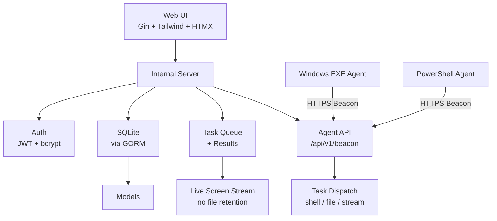

# ForgeC2

[English](./README.md) | [中文](./README.zh.md)

**Professional Command & Control Framework for Authorized Red Team Operations**

ForgeC2 is a modern, single-binary, operator-friendly C2 framework built in pure Go. It features a beautiful dark-themed web interface, two agent types (native Windows EXE + PowerShell), live screen streaming (no file retention), on-demand screenshots (pure Go for EXE), file operations, and robust task management — designed for solo operators and professional security teams.

## Features

- **Beautiful Modern Web UI** (port 8080) — Deep professional dark theme with Tailwind + HTMX
- **Two Agent Types**:
  - Native Windows `.exe` (pure Go, cross-compiled via ldflags)
  - PowerShell `.ps1` (fileless-friendly)
- **Core Capabilities**:
  - Shell execution (cmd.exe / powershell.exe)
  - Live screen monitoring (stream-based, no file retention)
  - On-demand screenshots (pure Go GDI for EXE)
  - File operations (list, read, delete, upload, download)
  - Process listing, kill, etc.
- **HTTPS support** with automatic self-signed certificates
- **Configurable TLS verification** per generated agent
- **Single-user authentication** with bcrypt + JWT
- **SQLite + GORM**
- **WebSocket real-time updates** for tasks and screen
- **Docker ready**
- **Clean architecture** with split handlers and improved maintainability

### Recent Improvements
- Pure Go screenshot implementation for EXE agents (no PowerShell dependency)
- Stream-based live screen monitoring instead of repeated screenshot tasks
- Automatic cleanup of monitoring placeholder tasks on stop
- No disk retention of monitoring screenshots
- Normalized task fields (Path/Data)
- Enhanced audit logging
- File transfer size limits
- Refactored handlers and improved WebSocket push notifications

## Quick Start

### 1. Build & Run (Recommended)

```bash
git clone https://github.com/Ruka-afk/forgec2.git
cd forgec2
go mod tidy
go run ./cmd/server
```

The server will start on **http://0.0.0.0:8080** (TLS can be enabled in config.yaml)

On first access you will be prompted to set the operator password.

### 2. Using Docker

```bash
docker-compose up --build
```

### 3. Access the UI

Open your browser to `http://your-server-ip:8080` (or https if tls_enabled: true). Accept self-signed cert warning in lab.

Login with the password you set on first run.

## Generating & Deploying Agents

### Windows EXE
1. Go to **Generate Agent** page
2. Customize C2 URL (use your public IP or domain + :8080), interval, jitter, User-Agent
3. (Optional) Enable basic persistence
4. Click **Generate & Download EXE**
5. Transfer `forgec2_agent.exe` to target Windows machine and execute

### PowerShell
Same process, downloads a `.ps1` file. Can be executed directly or via `powershell -ep bypass -f forgec2_agent.ps1`

Both agents support the same beacon protocol and features.

## Architecture



> Mermaid diagrams are rendered on GitHub. If it doesn't show, try refreshing or view the raw Markdown.
```
## Configuration

Edit `config.yaml` (auto-created on first run):

```yaml
server:
  port: 8080
  host: 0.0.0.0
  tls_enabled: false
  cert_file: data/server.crt
  key_file: data/server.key
  jwt_secret: <auto-generated>
database:
  path: data/db/forgec2.db
agent:
  default_interval: 10
  default_jitter: 20
# ...
```

During agent generation you can choose to skip TLS verification for self-signed C2 servers.

## Testing the Full Loop (Recommended Lab Flow)

1. Start ForgeC2 server on your attack machine (Kali / Windows / Docker)
2. Generate Windows EXE or PS1
3. Copy to a Windows 10/11 VM or test host **you own**
4. Run the agent → it should appear in **Agents** list within 10-30s
5. Click **DETAILS** → send `whoami`, `ipconfig`, etc.
6. Use **Live Screen Monitor** (stream-based, no files saved) or request on-demand Screenshot
7. Check **Task History** (monitoring tasks are auto-cleaned after stop)
8. Add notes, delete test agents when done

## Legal Disclaimer (IMPORTANT)

**THIS SOFTWARE IS PROVIDED FOR AUTHORIZED SECURITY TESTING, RED TEAM EXERCISES, AND EDUCATIONAL PURPOSES ONLY.**

- You must have **explicit written authorization** from the system owner before deploying any agent or interacting with any system using ForgeC2.
- Unauthorized access to computer systems is a criminal offense in most jurisdictions (e.g. Computer Fraud and Abuse Act in the US, Computer Misuse Act in UK, etc.).
- The developers and contributors of ForgeC2 assume **no liability** for any misuse, damage, or illegal activity performed with this tool.
- By using this software you agree that you are solely responsible for your actions and will comply with all applicable laws.

**If you do not have authorization — do not use this tool.**

## Commercial / Professional Use

ForgeC2 is designed with clean separation of concerns (`cmd/`, `internal/server`, `internal/payload`, `internal/db`) making it easy to extend with:

- Linux / macOS agents
- Advanced file transfer (chunked/resume)
- EDR evasion modules
- Reporting / export features
- Multi-user support

Contact the author for commercial licensing or custom development.

## Roadmap (Community)

- [x] Pure Go screenshot for EXE agents
- [x] Stream-based live screen monitoring (no file retention)
- [x] Automatic cleanup of monitoring tasks
- [x] Improved WebSocket task updates
- [ ] Linux implant
- [ ] Keylogger module
- [ ] Better / chunked file transfer
- [ ] Enhanced persistence options
- [ ] Multi-user / RBAC support

## License

This project is licensed under a custom license for authorized security professionals. See `LICENSE` (or contact for commercial).

**Built with ❤️ for the red team community.**

---

*ForgeC2 — Forge your access. Control your narrative.*
