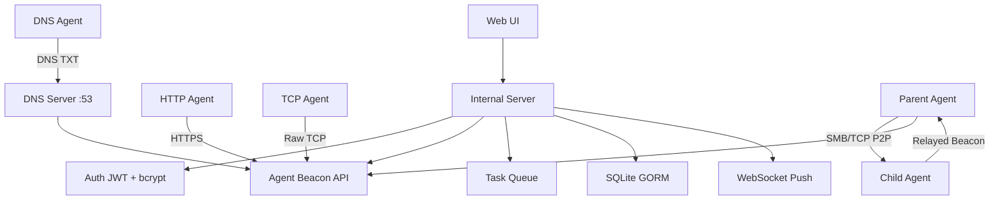

# ForgeC2

[English](./README.md) | [中文](./README.zh.md)

**Professional Command & Control Framework for Authorized Red Team Operations**

ForgeC2 is a modern, single-binary, operator-friendly C2 framework built in pure Go. It features P2P beacon chaining (SMB/TCP), DNS beaconing, an Artifact Kit (stager/stage), credential harvesting, 50+ task types, live screen streaming, and a beautiful dark-themed web interface — designed for solo operators and professional red teams.

## Features

### 🏗️ Core C2
- **Two transport layers**: HTTP(S) and TCP (raw length-prefixed framing)
- **DNS Beacon**: UDP DNS TXT queries on `:53` for stealthy egress
- **P2P Beacon Chaining**: SMB Named Pipes (Windows) / Unix sockets (Linux) and TCP relay — agents form parent-child topology
- **Malleable C2 Profiles**: Configurable HTTP response headers, cookies, User-Agent, beacon URI, HTTP method (GET/POST)
- **Multi-listener support**: HTTP, HTTPS, TCP listeners with independent configs
- **Configurable sleep/jitter** per agent with on-the-fly `set_sleep` command

### 🎨 Artifact Kit
- **Stage**: Full beacon EXE encoded with XOR + base64, served via `GET /stage/:xorKey`
- **Stager**: Minimal Go binary (stdlib only) that fetches stage from C2, decodes, writes to temp file, and executes
- **Linux stager**: ELF variant of the stager
- **Path traversal protection** on all stage/file endpoints

### 🧠 Agent Capabilities (50+ Task Types)
| Category | Tasks |
|----------|-------|
| **Shell & System** | `shell`, `ps`, `killproc`, `suspend`, `resume`, `reboot`, `shutdown`, `services`, `drives`, `users`, `av`, `netstat`, `portscan` |
| **File Operations** | `ls`, `read`, `delete`, `upload`, `download`, `download_url`, `find` files |
| **Credentials** | `creds` (SAM/SYSTEM/LSASS dump), `mimikatz` (via PowerShell), `kerberoast` (via .NET), auto-import to credential vault |
| **Lateral Movement** | `lateral` (WMI, WinRM, PsExec-style via schtasks), `inject` (CreateRemoteThread, APC, EarlyBird) |
| **Token Ops** | `token_list_procs`, `token_steal`, `token_make`, `token_revert`/`rev2self`, `token_whoami` |
| **Privilege Escalation** | `elevate` (UAC bypass), `elevate_printnightmare` |
| **Execution** | `execute_assembly` (.NET via PowerShell), `bof` (COFF loader with Beacon API stubs) |
| **Persistence** | `persist` (HKCU Run, schtasks, Startup folder), `uninstall` |
| **Surveillance** | `screenshot` (full screen), `screenshot_window`, `keylogger_start`/`stop`/`dump`, live screen streaming |
| **Network** | `portscan`, `socks` (SOCKS5 proxy relay through C2), `download_url` |
| **Other** | `beacon_now`, `set_sleep`, `kill_av`, clipboard get/set, registry ops, `kill` agent |

### 🖥️ Web UI (Gin + HTMX + Tailwind CSS)
- **Dashboard**: Active agent count, task throughput, recent activity
- **Agent Detail Page**: Full agent info, notes/tags, parent-child topology graph
- **Shell Interface**: Real-time command execution with output display
- **File Browser**: Navigate, upload, download, delete files on agent
- **Live Screen Monitor**: Stream-based, zero disk retention, WebSocket push
- **Task History**: Sortable, filterable with result previews
- **Audit Log**: Full operator action logging with IP tracking
- **Credential Vault**: Auto-harvested credentials from mimikatz/kerberoast
- **Token Vault**: Stolen/created tokens with integrity level display
- **Agent Topology Graph**: Visual P2P parent-child network
- **Settings Page**: Listener CRUD, user management, configuration

### 🔒 Security & Hardening
- **JWT + bcrypt authentication** with session management
- **CSRF protection** on all state-changing routes
- **Rate limiting** per-client IP (Gin sliding window)
- **Audit logging** for all sensitive operations
- **Path traversal prevention** (`safeJoin` on all file paths)
- **Secure cookie flags** (SameSite=Strict, Secure when TLS, HttpOnly)
- **Directory permissions**: 0700 for cert/db/config, 0600 for files
- **WebSocket keepalive** (ping/pong + 30s ticker + 60s read deadline)
- **Input sanitization** (XSS escaping on search/user input)
- **JWT secret redacted** from config downloads

### 🧩 Database
- **SQLite via GORM** with auto-migration
- **Indexed foreign keys** for performant queries at scale
- **Models**: Agent, Task, CredentialEntry, TokenEntry, SocksSession, AuditLog, Listener, User, BeaconHistory
- **Batch inserts** (50/batch) for credential dedup
- **Streaming DB backups** via `io.Copy`

## Quick Start

### 1. Build & Run (Recommended)

```bash
git clone https://github.com/Ruka-afk/forgec2.git
cd forgec2
go mod tidy
go run ./cmd/server
```

The server starts on **http://0.0.0.0:8080** (TLS configurable in `config.yaml`).

On first access you will be prompted to set the operator password.

### 2. Using Docker

```bash
docker-compose up --build
```

### 3. Generate & Deploy an Agent

1. Go to **Generate** page
2. Set C2 URL, interval, jitter, User-Agent
3. Choose Artifact Kit stager (Windows EXE) or PowerShell
4. Deploy and wait for beacon — agent appears within 10-30s

## Architecture



## Agent Generation & Artifact Kit

### Payload Types
| Type | Format | Build Method |
|------|--------|-------------|
| Native EXE | PE (Windows) | `go build` with ldflags |
| Stager (Windows) | Minimal PE | stdlib-only, downloads stage |
| Stager (Linux) | ELF | stdlib-only, downloads stage |
| Stage | Encoded EXE | XOR + base64, served via HTTP |
| PowerShell | .ps1 | PowerShell template with embedded config |

### Stage Flow
1. Operator generates stage (XOR key generated per-stage)
2. Stage stored as `data/agents/stage_<xorKeyHex>.enc`
3. Stager requests `GET /stage/:xorKey`
4. Stager decodes (base64 → XOR) and executes from temp file

## P2P Beacon Chaining

ForgeC2 supports parent-child agent topology for operating in segmented networks:

- **SMB mode**: Windows Named Pipes (`\\.\pipe\name`) via `go-winio`; Linux Unix sockets (`/tmp/name`)
- **TCP mode**: Raw TCP connections between agents
- **Automatic relay**: Child results forwarded by parent to C2; server distributes tasks to children through parent
- **Stale child cleanup**: UUIDs pruned after 10 minutes of inactivity

## DNS Beacon

- UDP DNS server on `:53`
- Agent queries TXT records at `<uuid>.beacon.c2domain`
- Response contains base64-encoded JSON beacon data
- Requires admin/root to bind privileged port

## Security Audits & Fixes

The codebase has undergone a comprehensive security audit addressing 12 findings:

- Config secret redaction (JWT, password hash)
- Path traversal prevention (`safeJoin`)
- XSS sanitization (template.HTMLEscapeString)
- WS lock contention fix (snapshot-based broadcast)
- Upload size limits (MaxUploadSize=50MB)
- Cookie Secure flag (conditional on TLS)
- Rate limiter IP spoofing fix (socket IP only)
- Directory/file permissions hardening (0700/0600)
- WS keepalive (ping/pong + deadlines)
- DB backup streaming (io.Copy)
- Credential batch insert (CreateInBatches)
- Global state → Server struct refactor (screenMonitorAgents)

## Legal Disclaimer (IMPORTANT)

**THIS SOFTWARE IS PROVIDED FOR AUTHORIZED SECURITY TESTING, RED TEAM EXERCISES, AND EDUCATIONAL PURPOSES ONLY.**

- You must have **explicit written authorization** before deploying any agent.
- Unauthorized access is a criminal offense in most jurisdictions.
- The developers assume **no liability** for misuse or illegal activity.
- By using this software you agree to comply with all applicable laws.

**If you do not have authorization — do not use this tool.**

## Roadmap

- [x] Pure Go screenshot (EXE agents)
- [x] Live screen streaming (zero disk retention)
- [x] TCP transport layer
- [x] Linux agent (basic: shell/ps/ls/file)
- [x] Keylogger (Windows GetAsyncKeyState)
- [x] Process suspend/resume
- [x] SOCKS5 relay through C2
- [x] P2P beacon chaining (SMB/TCP)
- [x] DNS beacon
- [x] Artifact Kit (stager/stage)
- [x] Credential auto-import (mimikatz/kerberoast)
- [x] Execute-assembly & BOF loader
- [x] Token ops (steal/make/revert/whoami)
- [x] Malleable C2 profiles
- [x] Multi-listener support
- [x] Security audit (12 fixes)
- [ ] Enhanced persistence options
- [ ] Multi-user / RBAC
- [ ] macOS agent
- [ ] EDR evasion modules

## License

Custom license for authorized security professionals. See `LICENSE` or contact for commercial licensing.

---

*ForgeC2 — Forge your access. Control your narrative.*
