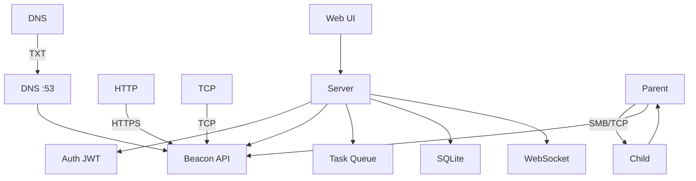

# ForgeC2

[English](./README.md) | [中文](./README.zh.md)

**Professional C2 Framework for Authorized Red Team Operations**

ForgeC2 is a modern, single-binary C2 framework in pure Go. P2P chaining, DNS beaconing, Artifact Kit, AI Assistant, 50+ task types, live screen streaming.

**v1.3.0** — AI Assistant · Implant Terminology · 3-State Status · 33 Externalized JS · Security Hardening

## Features

### 🤖 AI Assistant
- Multi-LLM: DeepSeek, OpenAI, Claude, Qianwen, Custom (OpenAI-compatible)
- Function calling: manage implants via natural language
- Streaming SSE with markdown (tables, code, lists)
- Reasoning display, localStorage persistence, Markdown export
- Safety: length cap, tool dedup, consecutive call limits

### 🏗️ C2 Core
- HTTP(S), TCP, DNS, ICMP transports
- P2P chaining: SMB Named Pipes / TCP relay
- 15+ malleable C2 profiles (bing, google, office365, teams, etc.)
- Multi-listener with independent configs
- Configurable sleep + jitter per implant

### 🧠 Implant Capabilities
| Category | Tasks |
|----------|-------|
| Shell & System | `shell`, `ps`, `killproc`, `suspend`, `resume`, `reboot` |
| Credentials | `creds`, `mimikatz`, `kerberoast`, `dcsync`, auto-vault |
| Lateral Movement | WMI, WinRM, PsExec, Pass-the-Hash, Pass-the-Ticket |
| Token Ops | steal, make, revert, whoami |
| Execution | execute-assembly, BOF, PowerPick, PE Loader |
| Persistence | Registry, schtasks, Startup, WMI, Service, COM hijack |
| Surveillance | screenshot, keylogger, live screen stream |
| Network | SOCKS5 relay, portscan, rportfwd |

### 🖥️ Web UI
- Dashboard with 3-state implant counts (online/stale/offline)
- Implant detail with public IP + GeoIP map
- Shell with compact toolbar dropdowns + command history
- Post-Exploitation Toolkit: 40+ categorized commands
- Generate page: shared listener selector, cross-platform builds
- Audit log with CSV export, credential vault with masked passwords
- Collapsible sidebar with online users panel

### 🔒 Security
- JWT + bcrypt, auto-generated secret, HttpOnly CSRF
- Rate limiting, audit logging, path traversal prevention
- Passwords never in HTML DOM (masked + API copy)
- XSS: DOM textContent escape, innerHTML sanitization
- 33 JS files externalized, NoRoute beacon catch-all

## Quick Start

```bash
git clone https://github.com/Ruka-afk/forgec2.git
cd forgec2 && go mod tidy && go run ./cmd/server
```

Server: `http://0.0.0.0:8080` · Default: `admin` / `admin`

## Architecture



## Roadmap

- [x] HTTP/HTTPS/TCP/DNS transport · P2P chaining
- [x] Artifact Kit · Malleable profiles · SOCKS5
- [x] Multi-user RBAC · Collaboration · AI Assistant
- [x] Security audit · JS externalization · 3-state status
- [x] Public IP + GeoIP · Post-Exploitation Toolkit
- [ ] macOS implant · EDR evasion

## Legal

**For authorized security testing only.** Written authorization required. See `LICENSE`.

---

*ForgeC2 — Forge your access. Control your narrative.*
