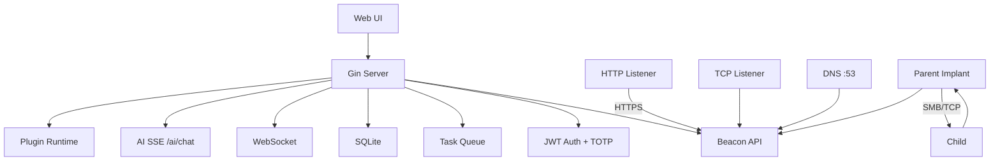

# ForgeC2

[](https://github.com/Ruka-afk/forgec2/actions/workflows/ci.yml)

[English](./README.md) | [中文](./README.zh.md)

**Professional C2 Framework for Authorized Red Team Operations**

ForgeC2 is a modern, single-binary command-and-control framework written in pure Go. It ships with a full web console, multi-transport beaconing, an AI assistant, plugin system, and 50+ implant task types — built for authorized red team engagements and security research.

**v2.1.0** — CI/CD · macOS Agent · Smart AI Wait · WebSocket Ping · EDR Basics · P1 Recon Tasks

---

## Highlights (v2.1.0)

| Area | What's New |
|------|------------|
| **AI Assistant** | Smart task wait (`wait_for_result`, polls by implant interval), chat persistence, optional fire-and-forget |
| **Shell** | Real-time 0s mode, UTF-8 fix, regen hint when DB interval differs from build |
| **Web UI** | WebSocket ping/pong (25s), 20× reconnect, stops HTTP poll when WS healthy |
| **Implant** | macOS `agent_darwin.go`, Linux autostart persistence, `cookie_export`, `vpn_creds`, enhanced keylog |
| **EDR** | Chunked sleep obfuscation (`evasion: true` / `FORGEC2_EVASION=1`) |
| **Ops** | GitHub Actions CI, Makefile, audit alerts (login lockout, bulk delete) |
| **Plugins** | 3 JSON samples in `plugins/samples/`, manifest plugins in `plugins/` |
| **DevEx** | 4 Grok skills in `.grok/skills/` (rebuild-deploy, fix-ui-page, add-i18n, add-ai-tool) |

---

## Features

### AI Assistant
- **Models**: DeepSeek, OpenAI, Claude, Qianwen, custom OpenAI-compatible endpoints
- **Function calling**: list agents, run commands, query tasks, credentials, listeners, operators
- **Smart wait**: `execute_command` polls task result using implant `current_interval` (max 60s); set `wait_for_result: false` to queue-only
- **Streaming**: SSE with markdown rendering, reasoning display, tool-call visibility
- **Persistence**: chat history + in-progress drafts survive page switches
- **Safety**: response length cap, tool deduplication, consecutive call limits

### C2 Core
- **Transports**: HTTP(S), TCP, DNS, ICMP
- **P2P chaining**: SMB named pipes / TCP relay
- **Malleable profiles**: 15+ presets (bing, google, office365, teams, …)
- **Multi-listener**: independent host/port/profile per listener
- **Sleep + jitter**: per-implant, supports 0s real-time mode

### Implant Capabilities

| Category | Tasks |
|----------|-------|
| Shell & System | `shell`, `ps`, `killproc`, `suspend`, `resume`, `reboot` |
| Credentials | `creds`, `mimikatz`, `kerberoast`, `dcsync`, auto-vault |
| Lateral Movement | WMI, WinRM, PsExec, Pass-the-Hash, Pass-the-Ticket |
| Token Ops | steal, make, revert, whoami |
| Execution | execute-assembly, BOF, PowerPick, PE Loader |
| Persistence | Registry, schtasks, Startup, WMI, Service, COM hijack |
| Surveillance | screenshot, keylogger (window-titled), live screen stream |
| Recon (P1) | `cookie_export` (Chrome/Edge SQLite), `vpn_creds` (OpenVPN/cmdkey/WinSCP) |
| Network | SOCKS5 relay, portscan, reverse port forward |
| Remote (stub) | `remote_input` task + `POST /api/agents/:id/input` |

### Web Console
- Dashboard with charts, heatmaps, geo map, attack-path view
- 3-state implant status (online / stale / offline)
- Implant detail: tabs, port forward, task history, current window title
- Shell, files, screen monitor, toolkit (40+ commands)
- Generate page: cross-platform builds, shared listener, malleable profile lock
- Global search, operator chat, audit log CSV export
- Collapsible sidebar, online users panel, keyboard shortcuts

### Plugins
- Drop-in plugins under `plugins/` with `manifest.yaml`
- Python / Go interpreters, timeout control, agent-side execution
- Web UI: install, enable/disable, execute, import/export, reviews

### Security
- JWT + bcrypt, HttpOnly session cookies, CSRF protection
- TOTP two-factor authentication with backup codes
- Per-route rate limiting (login, API, beacon)
- Audit logging, path traversal prevention
- Passwords never rendered in HTML DOM
- AES-GCM encrypted automatic database backups

---

## Quick Start

```bash
git clone https://github.com/Ruka-afk/forgec2.git
cd forgec2
go mod tidy
go build -o forgec2-server ./cmd/server
./forgec2-server -config config/config.yaml
```

Open **http://localhost:8080** — default credentials: `admin` / `admin`

> Copy `config/config.yaml` to `config.yaml` in the project root, or pass `-config` explicitly. On first run the server creates `data/` automatically.

### Windows Build

```powershell
go build -o server.exe ./cmd/server
.\server.exe -config config.yaml
```

### Frontend Asset Build (optional)

Templates embed JS/CSS via `go:embed`. After editing files under `internal/server/templates/static/`, rebuild bundles:

```powershell
powershell -ExecutionPolicy Bypass -File .\build_js.ps1 -SkipCSS
go build -o server.exe ./cmd/server
```

---

## Configuration

Key sections in `config.yaml`:

```yaml
server:
  port: 8080
  offline_threshold: 60      # seconds before "stale"
implant:
  default_interval: 0        # 0 = real-time shell mode
  default_jitter: 20
ai:
  enabled: true
  provider: deepseek
  api_key: "sk-..."
  model: deepseek-chat
rate_limit:
  login:
    max_attempts: 5
    lockout_time: 900
```

See `config/config.yaml` for the full reference template.

---

## AI Assistant Setup

1. Open **AI Assistant** in the sidebar
2. Click **Settings**, enable AI, choose provider, paste API key
3. Save — page reloads with AI ready

The assistant queues implant commands immediately and does **not** block on beacon intervals. Use natural language or quick-action buttons to manage your engagement.

---

## API Documentation

Interactive docs: **http://localhost:8080/api/docs**

OpenAPI spec: `api/openapi.yaml` (also served at `/api/docs/openapi.yaml`)

Authentication via session cookie (`forgec2_session`) from `POST /login`.

---

## Project Structure

```
forgec2/
├── cmd/server/          # Server entrypoint
├── cmd/i18n-tool/       # Translation management CLI
├── internal/
│   ├── server/          # HTTP handlers, templates, WebSocket, AI
│   ├── payload/agent/   # Implant source (Windows / Linux)
│   ├── plugin/          # Plugin runtime
│   ├── db/              # GORM models + SQLite
│   └── malleable/       # C2 profile engine
├── api/openapi.yaml     # REST API specification
├── plugins/             # Plugin packages
├── build_js.ps1         # JS/CSS bundler
└── config/config.yaml   # Configuration template
```

---

## Architecture



---

## Development

Common tasks are available via the project `Makefile`:

```bash
make build          # build server binary
make test           # run all Go tests
make i18n-check     # validate translations
make bundle         # rebuild embedded JS/CSS bundles
make dev            # dev mode (FORGEC2_DEV=1, unbundled JS)
```

Equivalent manual commands:

```bash
go test ./...
go run ./cmd/i18n-tool check --lang zh
FORGEC2_DEV=1 go run ./cmd/server -config config.yaml
```

### Agent Skills (Grok / Cursor)

All skills live in `.grok/skills/` — invoke via slash command or auto-trigger:

| Category | Skills |
|----------|--------|
| **Daily dev** | `rebuild-deploy`, `fix-ui-page`, `debug-forgec2`, `ci-fix`, `e2e-smoke-test` |
| **Features** | `add-task-type`, `add-agent-feature`, `add-ui-page`, `add-api-endpoint`, `add-i18n` |
| **AI & plugins** | `add-ai-tool`, `plugin-task`, `add-manifest-plugin` |
| **C2 & implant** | `add-malleable-profile`, `implant-regenerate`, `edr-evasion`, `add-recon-p1` |
| **Realtime & reports** | `websocket-event`, `report-section`, `remote-desktop` |

---

## Roadmap

- [x] HTTP/HTTPS/TCP/DNS/ICMP transport · P2P chaining
- [x] Artifact Kit · Malleable profiles · SOCKS5
- [x] Multi-user RBAC · Collaboration · AI Assistant
- [x] i18n · Plugins · OpenAPI · TOTP · Backups
- [x] JS bundling · Global search · Notification center
- [x] Real-time shell · AI chat persistence · smart task wait
- [x] macOS implant (basic: persistence, screencapture, osascript)
- [x] EDR evasion basics (chunked sleep, `evasion: true` / `FORGEC2_EVASION=1`)
- [x] P1 recon: cookie export, VPN creds, enhanced keylog
- [ ] Interactive remote desktop · IM steal · form grabber

---

## Legal

**For authorized security testing only.** You must have explicit written permission before deploying ForgeC2 against any system you do not own or manage. See [LICENSE](./LICENSE).

---

*ForgeC2 — Forge your access. Control your narrative.*