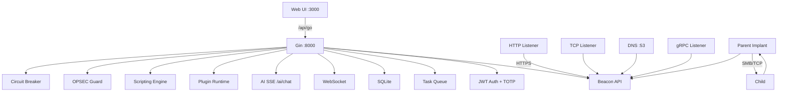

# ForgeC2

[](https://github.com/Ruka-afk/forgec2/actions/workflows/ci.yml)

[English](./README.md) | [中文](./README.zh.md)

**Professional C2 Framework for Authorized Red Team Operations**

ForgeC2 is a modern, single-binary command-and-control framework written in pure Go. It ships with a full Next.js web console, multi-transport beaconing, an AI assistant, plugin system, OPSEC guard, scripting engine, circuit breaker, and 50+ implant task types — built for authorized red team engagements and security research.

**v2.2.0** — Security overhaul · OPSEC Guard · Circuit Breaker · Scripting engine · gRPC transport · Auto-generated secrets · Next.js-only UI

---

## Architecture

ForgeC2 uses a **split-stack** layout:

| Component | Tech | Port | Path |
|-----------|------|------|------|
| **Web UI** | Next.js 16 + React 19 + Tailwind 4 | **3000** | `frontend/` |
| **API & C2** | Go (Gin, SQLite, WebSocket) | **8000** | `cmd/server/` |

- The browser talks to Next.js on `:3000`. API calls go through `/api/go/path` (proxy in `frontend/src/app/api/go/route.ts`).
- WebSocket connects directly to Go at `ws://host:8000/ws` with token-based auth (cross-port compatible).

### One-command start (Windows)

```powershell
powershell -ExecutionPolicy Bypass -File .\start.ps1
```

Opens **http://localhost:3000** (UI) and **http://localhost:8000** (API/health).

### Manual start

```powershell
# Terminal 1 — Go API
go build -o forgec2-server.exe ./cmd/server
.\forgec2-server.exe -config config.yaml

# Terminal 2 — Next.js dev server
cd frontend
npm install
npm run dev
```

For production UI: `cd frontend && npm run build && npm run start`

---

## Highlights (v2.2.0)

| Area | What's New |
|------|------------|
| **Security** | Auto-generated random admin password on first start; auto-generated JWT secret replaces hardcoded default; CSP/Referrer-Policy/Permissions-Policy headers; goroutine count removed from health endpoint |
| **OPSEC Guard** | New OPSEC rule engine — pre-flight safety checks before dispatching tasks; quick-test panel in Web UI |
| **Circuit Breaker** | Listener health monitoring — auto-burns listeners that fail health checks; triggers profile rotation |
| **Scripting** | Lua scripting engine — automate workflows server-side with `forgec2.*` API |
| **gRPC Transport** | New gRPC listener type for external C2 relay |
| **WebSocket Auth** | Token-based WebSocket auth via `?token=` query param (cross-port compatible without reverse proxy) |
| **Web UI** | Sidebar hydration fix, XSS sanitization strengthened, accessibility improvements (login form labels, focus states) |
| **Dead Code Cleanup** | Removed legacy Go HTML templates (150+ files), SRDI route, unused backup methods, unused validators, empty layouts |

---

## Features

### AI Assistant
- **Models**: DeepSeek, OpenAI, Claude, Qianwen, custom OpenAI-compatible endpoints
- **Function calling**: list agents, run commands, query tasks, credentials, listeners, operators
- **Smart wait**: `execute_command` polls task result using implant `current_interval` (max 60s); set `wait_for_result: false` to queue-only
- **Streaming**: SSE with markdown rendering, reasoning display, tool-call visibility
- **Persistence**: chat history + in-progress drafts survive page switches
- **Safety**: response length cap, tool deduplication, consecutive call limits

### C2 Core
- **Transports**: HTTP(S), TCP, DNS, ICMP, gRPC
- **P2P chaining**: SMB named pipes / TCP relay
- **Malleable profiles**: 15+ presets (bing, google, office365, teams, github, …)
- **Multi-listener**: independent host/port/profile per listener
- **Sleep + jitter**: per-implant, supports 0s real-time mode
- **Circuit Breaker**: automatic listener health monitoring and profile rotation

### OPSEC Guard
- Pre-flight rule engine — validates task safety before dispatch
- Built-in rules: known-bad arguments, dangerous command patterns
- Quick-test panel in Web UI to validate commands
- Extensible rule set via plugin system

### Implant Capabilities

| Category | Tasks |
|----------|-------|
| Shell & System | `shell`, `ps`, `killproc`, `suspend`, `resume`, `reboot` |
| Credentials | `creds`, `mimikatz`, `kerberoast`, `dcsync`, auto-vault |
| Lateral Movement | WMI, WinRM, PsExec, Pass-the-Hash, Pass-the-Ticket |
| Token Ops | steal, make, revert, whoami |
| Execution | execute-assembly, BOF, PowerPick, PE Loader |
| Persistence | Registry, schtasks, Startup, WMI, Service, COM hijack |
| Surveillance | screenshot, keylogger (window-titled), live screen stream |
| Recon (P1) | `cookie_export` (Chrome/Edge SQLite), `vpn_creds` (OpenVPN/cmdkey/WinSCP) |
| Network | SOCKS5 relay, portscan, reverse port forward |
| Remote | `remote_input` task + `POST /api/agents/:id/input` |

### Web Console (Next.js)
- **40+ pages** — dashboard, agents, shell, files, AI, OPSEC, circuit breaker, scripting, plugins, settings, and more
- Dashboard charts (heatmap, OS dist, task status, traffic, geo, attack path)
- Batch agent ops, kill/delete, agent detail with lock/notes/sleep/spawn
- Theme (light/dark/system), i18n (en/zh/ja/ko/ar), Ctrl+K search
- WebSocket live notifications, online operators panel
- Generate page: cross-platform builds, malleable profile lock

### Plugins
- Drop-in plugins under `plugins/` with `manifest.yaml`
- Python / Go interpreters, timeout control, agent-side execution
- Web UI: install, enable/disable, execute, import/export, reviews

### Scripting Engine
- Lua-based server-side automation
- `forgec2.*` API: execute tasks, query agents, manage listeners
- Timeout-controlled execution (30s default)
- Web UI editor and output panel

### Security
- JWT + bcrypt, HttpOnly secure session cookies
- TOTP two-factor authentication with backup codes
- Auto-generated random admin password on first start (printed to console)
- Auto-generated JWT secret replaces default on first run
- CSP, X-Content-Type-Options, X-Frame-Options, Referrer-Policy, Permissions-Policy headers
- Per-route rate limiting (login, API, beacon)
- IP-based login lockout with progressive delay
- Audit logging, path traversal prevention
- AES-GCM encrypted automatic database backups

---

## Quick Start

```bash
git clone https://github.com/Ruka-afk/forgec2.git
cd forgec2
go mod tidy
go build -o forgec2-server ./cmd/server
./forgec2-server -config config/config.yaml
```

Open **http://localhost:3000** (Next.js UI). On first run a random admin password is generated and printed to the console — **check the server output for your credentials**.

> API-only mode: `http://localhost:8000`. Copy `config/config.yaml` to `config.yaml` in the project root.

### Windows Build

```powershell
go build -o forgec2-server.exe ./cmd/server
.\forgec2-server.exe -config config.yaml
```

---

## Configuration

Key sections in `config.yaml`:

```yaml
server:
  port: 8000
  offline_threshold: 60      # seconds before "stale"
implant:
  default_interval: 0        # 0 = real-time shell mode
  default_jitter: 20
ai:
  enabled: true
  provider: deepseek
  api_key: "sk-..."
  model: deepseek-chat
rate_limit:
  login:
    max_attempts: 5
    lockout_time: 900
```

See `config/config.yaml` for the full reference template.

---

## AI Assistant Setup

1. Open **AI Assistant** in the sidebar
2. Click **Settings**, enable AI, choose provider, paste API key
3. Save — page reloads with AI ready

The assistant queues implant commands immediately and does **not** block on beacon intervals.

---

## API Documentation

Interactive docs: **http://localhost:8000/api/docs**

OpenAPI spec: `api/openapi.yaml` (also served at `/api/docs/openapi.yaml`)

Authentication via session cookie (`forgec2_session`) from `POST /login`.

---

## Project Structure

```
forgec2/
├── cmd/server/          # Server entrypoint
├── cmd/i18n-tool/       # Translation management CLI
├── internal/
│   ├── server/          # HTTP handlers, WebSocket, AI, OPSEC, scripting
│   ├── payload/agent/   # Implant source (Windows / Linux / macOS)
│   ├── plugin/          # Plugin runtime
│   ├── scripting/       # Lua scripting engine
│   ├── db/              # GORM models + SQLite
│   ├── config/          # Configuration loader
│   ├── malleable/       # C2 profile engine
│   ├── crypto/          # Encryption utilities
│   ├── report/          # Report generator
│   └── infrastructure/  # Auto-generated redirector configs
├── frontend/            # Next.js web UI
├── api/openapi.yaml     # REST API specification
├── plugins/             # Plugin packages
└── config/config.yaml   # Configuration template
```

---

## Architecture


```mermaid
graph TD
    A[Web UI :3000] -->|/api/go| B[Gin :8000]
    B --> C[JWT Auth + TOTP]
    B --> D[Beacon API]
    B --> E[Task Queue]
    B --> F[SQLite]
    B --> G[WebSocket]
    B --> H[AI SSE /ai/chat]
    B --> I[Plugin Runtime]
    B --> J[Scripting Engine]
    B --> K[OPSEC Guard]
    B --> L[Circuit Breaker]
    M[HTTP Listener] -->|HTTPS| D
    N[TCP Listener] --> D
    O[DNS :53] --> D
    P[gRPC Listener] --> D
    Q[Parent Implant] -->|SMB/TCP| R[Child] --> Q --> D
```

---

## Development

```bash
go build ./...           # build all packages
go test ./...            # run all Go tests
go vet ./...             # static analysis
make i18n-check          # validate translations
```

### Agent Skills (Grok / Cursor / OpenCode)

All skills live in `.grok/skills/` and `.opencode/skills/` — invoke via slash command or auto-trigger:

| Category | Skills |
|----------|--------|
| **Daily dev** | `rebuild-deploy`, `fix-ui-page`, `fix-ui-style`, `debug-forgec2`, `ci-fix`, `e2e-smoke-test`, `release-github`, `agent-build` |
| **Features** | `add-task-type`, `add-model`, `add-test`, `add-plugin-task`, `add-ui-page`, `add-api-endpoint`, `add-i18n` |
| **AI & plugins** | `add-ai-tool`, `configure-ai`, `plugin-task`, `add-manifest-plugin` |
| **C2 & listeners** | `add-listener`, `add-malleable-profile`, `add-transport-protocol`, `add-stager`, `add-extc2`, `add-generate-option` |
| **Implant** | `implant-regenerate`, `edr-evasion`, `add-recon-p1`, `add-injection-technique`, `add-bof` |
| **Ops modules** | `add-lateral-method`, `add-credentials-feature`, `add-monitor-feature`, `add-socks-pivot`, `add-token-feature` |
| **Security** | `go-vet-lint`, `add-user-rbac`, `credential-parser` |
| **Realtime & reports** | `internal-event`, `report-section`, `websocket-event`, `remote-desktop` |

---

## Deployment

### Docker

```yaml
docker compose up -d
```

The compose file creates `forgec2-server`, pulls the frontend image, and auto-generates TLS + JWT secrets on first run. Config is at `config.yaml` in the mounted volume.

### Hardening checklist
- Use a reverse proxy (nginx/Caddy) to terminate TLS in production
- Restrict `/api/go` proxy to known routes
- Enable TOTP 2FA for all users
- Rotate JWT secret via `/api/settings/jwt/regenerate` (or set `FORGEC2_JWT_SECRET` env)
- Review audit logs regularly (`AuditLog` table)
- Use `VACUUM` and DB backups via Settings UI

---

## Roadmap

- [x] HTTP/HTTPS/TCP/DNS/ICMP/gRPC transport · P2P chaining
- [x] Artifact Kit · Malleable profiles · SOCKS5
- [x] Multi-user RBAC · Collaboration · AI Assistant
- [x] i18n · Plugins · OpenAPI · TOTP · Backups
- [x] OPSEC Guard · Circuit Breaker · Scripting Engine
- [x] Real-time shell · AI chat persistence · smart task wait
- [x] macOS implant · EDR evasion (chunked sleep)
- [x] P1 recon: cookie export, VPN creds, enhanced keylog
- [x] Security overhaul: auto-generated secrets, CSP headers, token-based WS auth
- [x] Dead code cleanup: removed legacy Go templates (pure Next.js UI)
- [ ] Interactive remote desktop · Form grabber · IM steal

---

## Legal

**For authorized security testing only.** You must have explicit written permission before deploying ForgeC2 against any system you do not own or manage. See [LICENSE](./LICENSE).

---

*ForgeC2 — Forge your access. Control your narrative.*
