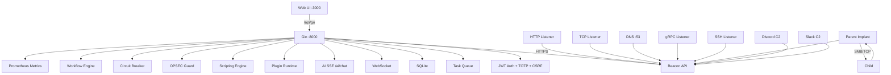

# ForgeC2

[](https://github.com/Ruka-afk/forgec2/actions/workflows/ci.yml)

[English](./README.md) | [中文](./README.zh.md)

**Professional C2 Framework for Authorized Red Team Operations**

ForgeC2 is a modern, single-binary command-and-control framework written in pure Go. It ships with a full Next.js web console, multi-transport beaconing, AI assistant, plugin system, OPSEC guard, scripting engine, circuit breaker, and 50+ implant task types — built for authorized red team engagements and security research.

**v2.3.0** — Frontend-Backend Separation · Cross-Domain Deployment · Panic Recovery · 40+ New Modules · CSRF Protection

---

## Architecture

ForgeC2 uses a **split-stack** layout with full frontend-backend separation:

| Component | Tech | Default Port | Path |
|-----------|------|------|------|
| **Web UI** | Next.js 16 + React 19 + Tailwind 4 + shadcn/ui | **3000** | `frontend/` |
| **API & C2** | Go (Gin, SQLite, WebSocket) | **8000** | `cmd/server/` |

- The browser talks to Next.js on `:3000`. API calls go through `/api/go/path` (proxy in Next.js rewrites).
- WebSocket connects directly to Go at `ws://host:8000/ws` with token-based auth.
- **Frontend and backend can run independently** on separate hosts/domains (see [Cross-Domain Deployment](#cross-domain-deployment)).

### One-command start (Windows)

```powershell
powershell -ExecutionPolicy Bypass -File .\start.ps1
```

Opens **http://localhost:3000** (UI) and **http://localhost:8000** (API/health).

### Manual start

```powershell
# Terminal 1 — Go API
go build -o forgec2-server.exe ./cmd/server
.\forgec2-server.exe -config config.yaml

# Terminal 2 — Next.js dev server
cd frontend
npm install
npm run dev
```

For production UI: `cd frontend && npm run build && npm start`

---

## What's New in v2.3.0

### Frontend-Backend Separation

Frontend and backend can now run independently on different hosts/domains:

```bash
# Frontend (.env.local)
NEXT_PUBLIC_API_BASE=https://api.example.com
NEXT_PUBLIC_WS_URL=wss://api.example.com

# Backend (config.yaml)
server:
  allowed_origins:
    - "app.example.com"
  cookie_domain: ".example.com"
  tls_enabled: true
```

| Config | Purpose | Default |
|--------|---------|---------|
| `NEXT_PUBLIC_API_BASE` | Frontend API base URL | `/api/go` (proxy) |
| `NEXT_PUBLIC_WS_URL` | WebSocket base URL | `ws://hostname:PORT` |
| `server.allowed_origins` | CORS/WebSocket origin allowlist | all (empty = permissive) |
| `server.cookie_domain` | Session cookie domain attribute | empty (same host) |

### Security Hardening

| Feature | Details |
|---------|---------|
| **CSRF Protection** | Double-submit cookie pattern (`forgec2_csrf` + `X-CSRF-Token` header) |
| **SameSite Cookies** | All session/CSRF cookies use `SameSite=Lax` for cross-origin safety |
| **Configurable CORS** | `allowed_origins` config controls WebSocket and HTTP CORS |
| **Cookie Domain** | `cookie_domain` config for cross-origin cookie sharing |
| **Request Body Limits** | 2MB max JSON body size, prevents payload flooding |
| **Panic Recovery** | All fire-and-forget goroutines wrapped with `recover()` |

### Bug Fixes

| Issue | Fix |
|-------|-----|
| WebSocket hub race condition | `sync.Once` initialization |
| Rate limiter goroutine leak | Context-cancellable cleanup goroutine |
| Circuit breaker goroutine leak | `Stop()` method with `stopCh` channel |
| SOCKS relay DB thrashing | In-memory byte accumulation, flush every 100 packets |
| SOCKS relay lock contention | Per-connection snapshot-and-drain under individual locks |
| Agent broadcast race | `broadcastAgentOnline` called synchronously |
| Login lockout memory leak | Periodic cleanup goroutine with context cancellation |
| Unbounded query cache | Replaced `sync.Map` with bounded `TTLCache` (1000 entries, 5min TTL) |

### 40+ New Modules

See [Features](#features) for the full list of new capabilities.

---

## Highlights (v2.2.0 → v2.3.0)

| Area | What's New |
|------|------------|
| **Deployment** | Frontend-backend fully separable; CDN/origin deployment support |
| **Security** | CSRF protection, SameSite cookies, request body limits, configurable CORS/origins |
| **Stability** | Panic recovery, goroutine leak fixes, bounded cache, reduced lock contention |
| **External C2** | Discord and Slack external C2 channels |
| **Operations** | Campaigns, phishing, BloodHound, NTLM relay, container escape, domain fronting |
| **Automation** | Task scheduler, workflow engine, auto-tagging, scheduled reports |
| **RBAC** | Custom roles, per-resource permission gates, collaboration with task claiming |
| **Monitoring** | Prometheus metrics, log rotation, traffic profiling, agent health plugins |
| **Plugins** | 40+ plugins (recon, hooks, reports, credential analysis) |
| **Frontend** | 60+ new pages, shadcn/ui component library, i18n (en/zh/ja/ko/ar), vitest |

---

## Features

### AI Assistant
- **Models**: DeepSeek, OpenAI, Claude, Qianwen, custom OpenAI-compatible endpoints
- **Function calling**: list agents, run commands, query tasks, credentials, listeners, operators
- **Smart wait**: `execute_command` polls task result using implant `current_interval` (max 60s)
- **Streaming**: SSE with markdown rendering, reasoning display, tool-call visibility
- **Persistence**: chat history + in-progress drafts survive page switches

### C2 Core
- **Transports**: HTTP(S), TCP, DNS, ICMP, gRPC, SSH
- **P2P chaining**: SMB named pipes / TCP relay
- **Malleable profiles**: 15+ presets (bing, google, office365, teams, github, ...)
- **Multi-listener**: independent host/port/profile per listener
- **Sleep + jitter**: per-implant, supports 0s real-time mode
- **Circuit Breaker**: automatic listener health monitoring and profile rotation
- **External C2**: Discord, Slack channels for agent relay
- **DNS**: DoH, DoT, IPv6 AAAA record tunneling

### OPSEC Guard
- Pre-flight rule engine — validates task safety before dispatch
- Built-in rules: known-bad arguments, dangerous command patterns
- Quick-test panel in Web UI to validate commands

### Implant Capabilities

| Category | Tasks |
|----------|-------|
| Shell & System | `shell`, `ps`, `killproc`, `suspend`, `resume`, `reboot` |
| Credentials | `creds`, `mimikatz`, `kerberoast`, `dcsync`, auto-vault |
| Lateral Movement | WMI, WinRM, PsExec, Pass-the-Hash, Pass-the-Ticket |
| Token Ops | steal, make, revert, whoami |
| Execution | execute-assembly, BOF, PowerPick, PE Loader, CLR hosting |
| Persistence | Registry, schtasks, Startup, WMI, Service, COM hijack, IFEO |
| Surveillance | screenshot, keylogger (window-titled), live screen stream, recording |
| Recon (P1) | `cookie_export` (Chrome/Edge SQLite), `vpn_creds`, `wifi_creds` |
| Network | SOCKS5 relay, portscan, reverse port forward, NTLM relay |
| Evasion | AMSI bypass, ETW bypass, VEH unhook, hardware breakpoints, sleep mask, sandbox detection |
| Remote | `remote_input`, remote desktop, clipboard get/set |
| Container | Docker detect, Kubernetes, container escape |
| Cloud | Cloud credential harvesting, Chrome extension C2 |
| Token | Token steal/make/revert, impersonation |

### Web Console (Next.js)
- **60+ pages** — dashboard, agents, shell, files, AI, OPSEC, circuit breaker, scripting, plugins, campaigns, phishing, BloodHound, workflows, scheduler, and more
- Dashboard charts (heatmap, OS dist, task status, traffic, geo, attack path, Gantt)
- Batch agent ops, kill/delete, agent detail with lock/notes/sleep/spawn/trust/kill-date
- Theme (light/dark/system), i18n (en/zh/ja/ko/ar), Ctrl+K search
- WebSocket live notifications, online operators panel
- Generate page: cross-platform builds (EXE/DLL/PS1/Linux/macOS), malleable profile lock
- Agent components: health ring, stats grid, task list, screenshots, traffic profile
- Loading/error states for every page (90+ boundary components)

### Plugins
- Drop-in plugins under `plugins/` with `manifest.yaml`
- 40+ plugins: recon (AD, DNS, process, network, registry, services, shares, tokens, WiFi), hooks (health monitor, anomaly detection, burn detection, credential rotation), reports (asset inventory, MITRE mapper, network topology, security posture)
- Web UI: install, enable/disable, execute, import/export, reviews, ratings

### Scripting Engine
- JavaScript-based server-side automation (goja runtime)
- `forgec2.*` API: execute tasks, query agents, manage listeners
- Timeout-controlled execution (30s default)
- Web UI editor and output panel

### Security
- JWT + bcrypt, HttpOnly secure session cookies with SameSite=Lax
- CSRF double-submit cookie protection
- TOTP two-factor authentication with backup codes
- Auto-generated random admin password on first start (printed to console)
- Auto-generated JWT secret replaces default on first run
- CSP, X-Content-Type-Options, X-Frame-Options, Referrer-Policy, Permissions-Policy headers
- Per-route rate limiting (login, API, beacon)
- IP-based login lockout with progressive delay
- Audit logging, path traversal prevention
- AES-GCM encrypted automatic database backups
- Request body size limits (2MB)

---

## Quick Start

```bash
git clone https://github.com/Ruka-afk/forgec2.git
cd forgec2
go mod tidy
go build -o forgec2-server ./cmd/server
./forgec2-server -config config.yaml
```

Open **http://localhost:3000** (Next.js UI). On first run a random admin password is generated and printed to the console — **check the server output for your credentials**.

> API-only mode: `http://localhost:8000`

### Windows Build

```powershell
go build -o forgec2-server.exe ./cmd/server
.\forgec2-server.exe -config config.yaml
```

### Cross-Domain Deployment

To deploy the frontend and backend on separate domains:

1. **Backend** — configure allowed origins and cookie domain:

```yaml
server:
  tls_enabled: true
  cert_file: data/server.crt
  key_file: data/server.key
  allowed_origins:
    - "app.example.com"
  cookie_domain: ".example.com"
```

2. **Frontend** — point to the backend:

```bash
# .env.local
NEXT_PUBLIC_API_BASE=https://api.example.com
NEXT_PUBLIC_WS_URL=wss://api.example.com
```

3. **Reverse proxy** (Nginx/Caddy) — route traffic:

```
app.example.com  → frontend static files (CDN or server)
api.example.com  → Go backend :8000
```

---

## Configuration

Key sections in `config.yaml`:

```yaml
server:
  port: 8000
  tls_enabled: false
  offline_threshold: 60      # seconds before "stale"
  allowed_origins: []         # CORS/WebSocket origins (empty = all)
  cookie_domain: ""           # session cookie domain
implant:
  default_interval: 0        # 0 = real-time shell mode
  default_jitter: 20
ai:
  enabled: true
  provider: deepseek
  api_key: "sk-..."
  model: deepseek-chat
rate_limit:
  login:
    max_attempts: 5
    lockout_time: 900
```

See `config.yaml` in the project root for the full reference template.

---

## AI Assistant Setup

1. Open **AI Assistant** in the sidebar
2. Click **Settings**, enable AI, choose provider, paste API key
3. Save — page reloads with AI ready

The assistant queues implant commands immediately and does **not** block on beacon intervals.

---

## API Documentation

Interactive docs: **http://localhost:8000/api/docs**

OpenAPI spec: `api/openapi.yaml` (also served at `/api/docs/openapi.yaml`)

Authentication via session cookie (`forgec2_session`) from `POST /login`.

---

## Project Structure

```
forgec2/
├── cmd/server/          # Server entrypoint
├── internal/
│   ├── server/          # HTTP handlers, WebSocket, AI, OPSEC, scripting (80+ files)
│   ├── payload/agent/   # Implant source (Windows / Linux / macOS)
│   ├── plugin/          # Plugin runtime
│   ├── scripting/       # JavaScript scripting engine
│   ├── db/              # GORM models + SQLite + TTL cache
│   ├── config/          # Configuration loader
│   ├── malleable/       # C2 profile engine (compiler, presets, transforms)
│   ├── crypto/          # Encryption, signing, loot encryption
│   └── infrastructure/  # Auto-generated redirector configs (Nginx, Apache, HAProxy, Caddy)
├── frontend/            # Next.js web UI (60+ pages)
├── api/openapi.yaml     # REST API specification
├── plugins/             # 40+ plugins (recon, hooks, reports)
├── extensions/          # Chrome extension
├── locales/             # i18n files (en, zh, ja, ko, ar)
├── docs/                # Design docs, Python API
├── pkg/                 # Shared protocol types, gRPC service
└── config.yaml          # Configuration template
```

---

## Architecture


```mermaid
graph TD
    A[Web UI :3000] -->|/api/go| B[Gin :8000]
    B --> C[JWT Auth + TOTP + CSRF]
    B --> D[Beacon API]
    B --> E[Task Queue]
    B --> F[SQLite]
    B --> G[WebSocket]
    B --> H[AI SSE /ai/chat]
    B --> I[Plugin Runtime]
    B --> J[Scripting Engine]
    B --> K[OPSEC Guard]
    B --> L[Circuit Breaker]
    B --> M[Workflow Engine]
    B --> N[Prometheus Metrics]
    O[HTTP Listener] -->|HTTPS| D
    P[TCP Listener] --> D
    Q[DNS :53] --> D
    R[gRPC Listener] --> D
    S[SSH Listener] --> D
    T[Parent Implant] -->|SMB/TCP| U[Child] --> T --> D
    V[Discord C2] --> D
    W[Slack C2] --> D
```

---

## Development

```bash
go build ./...           # build all packages
go test ./...            # run all Go tests
go vet ./...             # static analysis
go mod tidy              # clean dependencies
```

### Frontend Development

```bash
cd frontend
npm install
npm run dev              # dev server on :3000
npm run build            # production build
npm run check:css        # CSS architecture validation
npm run check:i18n       # i18n key consistency check
```

### Agent Skills (Grok / Cursor / OpenCode)

All skills live in `.grok/skills/` and `.opencode/skills/` — invoke via slash command or auto-trigger:

| Category | Skills |
|----------|--------|
| **Daily dev** | `rebuild-deploy`, `fix-ui-page`, `fix-ui-style`, `debug-forgec2`, `ci-fix`, `e2e-smoke-test`, `release-github`, `agent-build` |
| **Features** | `add-task-type`, `add-model`, `add-test`, `add-plugin-task`, `add-api-endpoint`, `add-sidebar-item` |
| **C2 & listeners** | `listener-type`, `add-malleable-profile`, `dns-tunneling`, `socks-proxy-setup`, `port-forward-setup` |
| **Implant** | `bypass-module`, `persistence-module`, `lateral-movement-module`, `reverse-shell-handler` |
| **Ops modules** | `campaign-wizard`, `phishing-template`, `credential-guardian`, `mass-ops`, `session-replay` |
| **Security** | `go-vet-lint`, `opsec-check`, `rbac-architect`, `credential-parser` |
| **Deployment** | `docker-deploy`, `https-cert-setup`, `domain-fronter`, `reverse-proxy-config` |
| **Realtime & reports** | `internal-event`, `report-section`, `auto-notify`, `timeline-analysis` |
| **Integrations** | `slack-bot-integration`, `telegram-bot-integration`, `jira-integration`, `thehive-integration` |

---

## Deployment

### Docker

```yaml
docker compose up -d
```

The compose file creates `forgec2-server`, pulls the frontend image, and auto-generates TLS + JWT secrets on first run. Config is at `config.yaml` in the mounted volume.

### Hardening checklist
- Use a reverse proxy (Nginx/Caddy) to terminate TLS in production
- Set `allowed_origins` to restrict WebSocket/CORS access
- Enable TOTP 2FA for all users
- Rotate JWT secret via `/api/settings/jwt/regenerate`
- Review audit logs regularly (`AuditLog` table)
- Use `VACUUM` and DB backups via Settings UI

---

## Roadmap

- [x] HTTP/HTTPS/TCP/DNS/ICMP/gRPC/SSH transport · P2P chaining
- [x] Artifact Kit · Malleable profiles · SOCKS5
- [x] Multi-user RBAC · Collaboration · AI Assistant
- [x] i18n · Plugins · OpenAPI · TOTP · Backups
- [x] OPSEC Guard · Circuit Breaker · Scripting Engine
- [x] Real-time shell · AI chat persistence · smart task wait
- [x] macOS implant · EDR evasion (chunked sleep, VEH unhook, hardware BP)
- [x] P1 recon: cookie export, VPN creds, WiFi creds, enhanced keylog
- [x] Security overhaul: auto-generated secrets, CSP headers, token-based WS auth
- [x] Dead code cleanup: removed legacy Go templates (pure Next.js UI)
- [x] **v2.3.0**: Frontend-backend separation, cross-domain deployment, CSRF, SameSite cookies
- [x] **v2.3.0**: Campaigns, phishing, BloodHound, NTLM relay, container escape, workflows
- [x] **v2.3.0**: 40+ plugins, Prometheus metrics, log rotation, task scheduler
- [ ] Interactive remote desktop (v2)
- [ ] Form grabber · IM steal

---

## Legal

**For authorized security testing only.** You must have explicit written permission before deploying ForgeC2 against any system you do not own or manage. See [LICENSE](./LICENSE).

---

*ForgeC2 — Forge your access. Control your narrative.*
