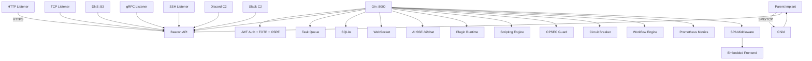

# ForgeC2

[](https://github.com/Ruka-afk/forgec2/actions/workflows/ci.yml)

[English](./README.md) | [中文](./README.zh.md)

**Professional C2 Framework for Authorized Red Team Operations**

ForgeC2 is a modern, single-binary command-and-control framework written in pure Go. It ships with a full Next.js web console, multi-transport beaconing, AI assistant, plugin system, OPSEC guard, scripting engine, circuit breaker, and 50+ implant task types — built for authorized red team engagements and security research.

**v2.4.0** — Single-Binary Deployment · Frontend Embedded · Docker 3-Stage Build · SPA Fallback

## Table of Contents

- [Prerequisites](#prerequisites)
- [Quick Start](#quick-start)
- [Features](#features)
- [Configuration](#configuration)
- [Architecture](#architecture)
- [API Documentation](#api-documentation)
- [Development](#development)
- [Deployment](#deployment)
- [Troubleshooting](#troubleshooting)
- [Changelog](#changelog)
- [Contributing](#contributing)
- [Legal](#legal)

---

## Prerequisites

| Tool | Version | Purpose |
|------|---------|---------|
| **Go** | 1.22+ | Backend compilation |
| **Node.js** | 20+ | Frontend build |
| **PowerShell** | 5.1+ (Windows) or **Bash** (Linux/macOS) | Build scripts |
| **Docker** | 24+ (optional) | Containerized deployment |
| **Git** | 2.30+ | Source control |

---

## Quick Start

### Single binary (recommended)

```bash
git clone https://github.com/Ruka-afk/forgec2.git
cd forgec2
```

**Option A — Build script** (requires Node.js + Go):

```powershell
powershell -File scripts\build-embedded.ps1
```

**Option B — Docker**:

```bash
docker compose up -d
```

Open **http://localhost:8000**. On first run a random admin password is generated and printed to the console — **check the server output for your credentials**.

### Manual build

```powershell
# 1. Build frontend
cd frontend
npm install
npm run build

# 2. Copy to embed directory
Remove-Item -Recurse -Force ..\internal\webdist\dist -ErrorAction SilentlyContinue
New-Item -ItemType Directory -Path ..\internal\webdist\dist | Out-Null
Copy-Item -Recurse -Path "out\*" -Destination "..\internal\webdist\dist\"

# 3. Build Go binary
cd ..
go build -o forgec2-server.exe ./cmd/server
.\forgec2-server.exe -config config.yaml
```

### Development (separate frontend/backend)

```powershell
# Terminal 1 — Go API
go build -o forgec2-server.exe ./cmd/server
.\forgec2-server.exe -config config.yaml

# Terminal 2 — Next.js dev server (connects to Go on :8000)
cd frontend
npm install
npm run dev
```

Opens **http://localhost:3000** (Next.js UI) with API on **http://localhost:8000**.

### Backend only (no frontend changes)

```powershell
powershell -File scripts\dev-backend.ps1
```

---

## Features

Capability depth varies by task and OS — see **[docs/CAPABILITY_MATRIX.md](./docs/CAPABILITY_MATRIX.md)** for Core / Hardened / Scripted / Experimental status. Advanced transport lab checklist: **[docs/TRANSPORT_E2E.md](./docs/TRANSPORT_E2E.md)**.

### AI Assistant
- **Models**: DeepSeek, OpenAI, Claude, Qianwen, custom OpenAI-compatible endpoints
- **Function calling**: list agents, run commands, query tasks, credentials, listeners, operators
- **Smart wait**: `execute_command` polls task result using implant `current_interval` (max 60s)
- **Streaming**: SSE with markdown rendering, reasoning display, tool-call visibility
- **Persistence**: chat history + in-progress drafts survive page switches

### C2 Core
- **Transports**: HTTP(S), TCP, DNS, ICMP, gRPC, SSH
- **P2P chaining**: SMB named pipes / TCP relay
- **Malleable profiles**: 15+ presets (bing, google, office365, teams, github, ...)
- **Multi-listener**: independent host/port/profile per listener
- **Sleep + jitter**: per-implant, supports 0s real-time mode
- **Circuit Breaker**: automatic listener health monitoring and profile rotation
- **External C2**: Discord, Slack channels for agent relay
- **DNS**: DoH, DoT, IPv6 AAAA record tunneling

### OPSEC Guard
- Pre-flight rule engine — validates task safety before dispatch
- Built-in rules: known-bad arguments, dangerous command patterns
- Quick-test panel in Web UI to validate commands

### Implant Capabilities

| Category | Tasks |
|----------|-------|
| Shell & System | `shell`, `ps`, `killproc`, `suspend`, `resume`, `reboot` |
| Credentials | `creds`, `mimikatz`, `kerberoast`, `dcsync`, auto-vault |
| Lateral Movement | WMI, WinRM, PsExec, Pass-the-Hash, Pass-the-Ticket |
| Token Ops | steal, make, revert, whoami |
| Execution | execute-assembly, BOF, PowerPick, PE Loader, CLR hosting |
| Persistence | Registry, schtasks, Startup, WMI, Service, COM hijack, IFEO |
| Surveillance | screenshot, keylogger (window-titled), live screen stream, recording |
| Recon (P1) | `cookie_export` (Chrome/Edge SQLite), `vpn_creds`, `wifi_creds` |
| Network | SOCKS5 relay, portscan, reverse port forward, NTLM relay |
| Evasion | AMSI bypass, ETW bypass, VEH unhook, hardware breakpoints, sleep mask, sandbox detection |
| Remote | `remote_input`, remote desktop, clipboard get/set |
| Container | Docker detect, Kubernetes, container escape |
| Cloud | Cloud credential harvesting, Chrome extension C2 |
| Token | Token steal/make/revert, impersonation |

### Web Console (Next.js)
- **60+ pages** — dashboard, agents, shell, files, AI, OPSEC, circuit breaker, scripting, plugins, campaigns, phishing, BloodHound, workflows, scheduler, and more
- Dashboard charts (heatmap, OS dist, task status, traffic, geo, attack path, Gantt)
- Batch agent ops, kill/delete, agent detail with lock/notes/sleep/spawn/trust/kill-date
- Theme (light/dark/system), i18n (en/zh), Ctrl+K search
- WebSocket live notifications, online operators panel
- Generate page: cross-platform builds (EXE/DLL/PS1/Linux/macOS), malleable profile lock

### Plugins
- Drop-in plugins under `plugins/` with `manifest.yaml`
- 40+ plugins: recon (AD, DNS, process, network, registry, services, shares, tokens, WiFi), hooks (health monitor, anomaly detection, burn detection, credential rotation), reports (asset inventory, MITRE mapper, network topology, security posture)
- Web UI: install, enable/disable, execute, import/export, reviews, ratings

### Scripting Engine
- JavaScript-based server-side automation (goja runtime)
- `forgec2.*` API: execute tasks, query agents, manage listeners
- Timeout-controlled execution (30s default)

### Security
- JWT + bcrypt, HttpOnly secure session cookies with SameSite=Lax
- CSRF double-submit cookie protection
- TOTP two-factor authentication with backup codes
- Auto-generated random admin password on first start (printed to console)
- Auto-generated JWT secret replaces default on first run
- CSP, X-Content-Type-Options, X-Frame-Options, Referrer-Policy, Permissions-Policy headers
- Per-route rate limiting (login, API, beacon)
- IP-based login lockout with progressive delay
- Audit logging, path traversal prevention
- AES-GCM encrypted automatic database backups
- Request body size limits (2MB)

---

## Architecture

ForgeC2 ships as a **single binary** with the full Next.js web console embedded via Go's `//go:embed`:

| Component | Tech | Port |
|-----------|------|------|
| **Web UI + API & C2** | Go (Gin, SQLite, WebSocket) with embedded Next.js static export | **8000** |

- The Go binary serves the SPA frontend directly — no separate frontend server needed.
- All API, WebSocket, and beacon endpoints live under the same port.
- SPA client-side routing is handled by a fallback middleware (any unmatched GET/HEAD serves `index.html`).


```mermaid
graph TD
    B[Gin :8000]
    B --> C[JWT Auth + TOTP + CSRF]
    B --> D[Beacon API]
    B --> E[Task Queue]
    B --> F[SQLite]
    B --> G[WebSocket]
    B --> H[AI SSE /ai/chat]
    B --> I[Plugin Runtime]
    B --> J[Scripting Engine]
    B --> K[OPSEC Guard]
    B --> L[Circuit Breaker]
    B --> M[Workflow Engine]
    B --> N[Prometheus Metrics]
    B --> P[SPA Middleware] --> Q[Embedded Frontend]
    O[HTTP Listener] -->|HTTPS| D
    R[TCP Listener] --> D
    S[DNS :53] --> D
    T[gRPC Listener] --> D
    U[SSH Listener] --> D
    V[Parent Implant] -->|SMB/TCP| W[Child] --> V --> D
    X[Discord C2] --> D
    Y[Slack C2] --> D
```

For detailed architecture, see [ARCHITECTURE.md](ARCHITECTURE.md).

---

## Configuration

Key sections in `config.yaml`:

```yaml
server:
  port: 8000
  tls_enabled: false
  offline_threshold: 60      # seconds before "stale"
  allowed_origins: []         # CORS/WebSocket origins (empty = all)
  cookie_domain: ""           # session cookie domain
implant:
  default_interval: 5        # seconds between beacon check-ins
  default_jitter: 20
ai:
  enabled: true
  provider: deepseek
  api_key: "sk-..."
  model: deepseek-chat
rate_limit:
  login:
    max_attempts: 5
    lockout_time: 900
```

See `config.yaml` in the project root for the full reference template.

---

## AI Assistant Setup

1. Open **AI Assistant** in the sidebar
2. Click **Settings**, enable AI, choose provider, paste API key
3. Save — page reloads with AI ready

The assistant queues implant commands immediately and does **not** block on beacon intervals.

---

## API Documentation

Interactive docs: **http://localhost:8000/api/docs**

OpenAPI spec: [`api/openapi.yaml`](api/openapi.yaml) (also served at `/api/docs/openapi.yaml`)

Authentication via session cookie (`forgec2_session`) from `POST /login`.

### Endpoints overview

| Method | Path | Description |
|--------|------|-------------|
| POST | `/login` | Authenticate (returns session cookie) |
| POST | `/logout` | End session |
| GET | `/api/me` | Current user info |
| GET | `/api/agents` | List all agents |
| GET | `/api/agents/:id` | Agent detail |
| POST | `/api/v1/beacon` | Agent check-in (no auth) |
| GET | `/api/dashboard/*` | Dashboard chart data |
| GET | `/api/listeners` | List listeners |
| GET | `/health` | Health check |
| GET | `/ready` | Readiness check |
| GET | `/metrics` | Prometheus metrics |
| GET | `/debug/pprof/` | Go profiling (pprof) |

---

## Development

### Full rebuild (frontend + backend + restart)

```powershell
powershell -File scripts\build-embedded.ps1
```

### Backend only (no frontend changes)

```powershell
powershell -File scripts\dev-backend.ps1
```

### Go commands

```bash
go build ./...           # build all packages
go test ./...            # run all Go tests
go vet ./...             # static analysis
go mod tidy              # clean dependencies
```

### Frontend Development (hot-reload)

```bash
cd frontend
npm install
npm run dev              # dev server on :3000 (proxies API to Go on :8000)
npm run build            # production build
npx tsc --noEmit         # type check
```

### Cross-Domain Deployment

For development with separate frontend and backend on different domains:

1. **Backend** — configure allowed origins and cookie domain:

```yaml
server:
  tls_enabled: true
  cert_file: data/server.crt
  key_file: data/server.key
  allowed_origins:
    - "app.example.com"
  cookie_domain: ".example.com"
```

2. **Frontend** — point to the backend:

```bash
# .env.local
NEXT_PUBLIC_API_BASE=https://api.example.com
NEXT_PUBLIC_WS_URL=wss://api.example.com
```

3. **Reverse proxy** (Nginx/Caddy) — route traffic:

```
app.example.com  → frontend static files (CDN or server)
api.example.com  → Go backend :8000
```

---

## Deployment

### Docker

```bash
docker compose up -d
```

The 3-stage Dockerfile builds the frontend (Node 20), compiles the Go binary with embedded assets (Golang 1.25), and produces a minimal Alpine runtime image (~20 MB). Config is at `config.yaml` in the mounted volume.

### Hardening checklist
- Use a reverse proxy (Nginx/Caddy) to terminate TLS in production
- Set `allowed_origins` to restrict WebSocket/CORS access
- Enable TOTP 2FA for all users
- Rotate JWT secret via `/api/settings/jwt/regenerate`
- Review audit logs regularly (`AuditLog` table)
- Use `VACUUM` and DB backups via Settings UI
- Set `require_tls_for_auth: true` in production

---

## Troubleshooting

### First-run password
On first start, a random admin password is generated and printed to the console. Check the server output or `config.yaml` for the actual value.

### Port already in use
If port 8000 is occupied, change `server.port` in `config.yaml` or stop the conflicting process.

### Docker volume issues
Ensure `config.yaml` and `data/` directory are mounted correctly:
```bash
docker compose up -d -v ./config.yaml:/app/config.yaml -v ./data:/app/data
```

### Frontend not loading
If the embedded frontend is not served, ensure the `internal/webdist/dist/` directory exists and contains the built frontend files.

### Database locked
SQLite supports one writer at a time. Reduce `MaxOpenConns` if experiencing lock contention under heavy load.

---

## Changelog

See [CHANGELOG.md](CHANGELOG.md) for the full version history.

---

## Contributing

See [CONTRIBUTING.md](CONTRIBUTING.md) for guidelines on submitting pull requests, code style, and testing.

---

## Project Structure

```
forgec2/
├── cmd/server/          # Server entrypoint
├── internal/
│   ├── server/          # HTTP handlers, WebSocket, AI, OPSEC, scripting (80+ files)
│   ├── payload/agent/   # Implant source (Windows / Linux / macOS)
│   ├── plugin/          # Plugin runtime
│   ├── scripting/       # JavaScript scripting engine
│   ├── db/              # GORM models + SQLite + TTL cache
│   ├── config/          # Configuration loader
│   ├── malleable/       # C2 profile engine (compiler, presets, transforms)
│   ├── crypto/          # Encryption, signing, loot encryption
│   ├── infrastructure/  # Auto-generated redirector configs (Nginx, Apache, HAProxy, Caddy)
│   └── webdist/         # Embedded frontend static files (//go:embed all:dist)
├── frontend/            # Next.js web UI (60+ pages)
├── scripts/             # Build/deploy scripts (dev-backend.ps1, build-embedded.ps1)
├── api/openapi.yaml     # REST API specification
├── plugins/             # 40+ plugins (recon, hooks, reports)
├── extensions/          # Chrome extension
├── locales/             # i18n files (en, zh)
├── docs/                # Design docs, Python API
├── pkg/                 # Shared protocol types, gRPC service
├── Dockerfile           # 3-stage build (Node → Go → Alpine)
├── docker-compose.yml   # Single service, volume-mounted config
└── config.yaml          # Configuration template
```

---

## Roadmap

- [x] HTTP/HTTPS/TCP/DNS/ICMP/gRPC/SSH transport · P2P chaining
- [x] Artifact Kit · Malleable profiles · SOCKS5
- [x] Multi-user RBAC · Collaboration · AI Assistant
- [x] i18n · Plugins · OpenAPI · TOTP · Backups
- [x] OPSEC Guard · Circuit Breaker · Scripting Engine
- [x] Real-time shell · AI chat persistence · smart task wait
- [x] macOS implant · EDR evasion (chunked sleep, VEH unhook, hardware BP)
- [x] P1 recon: cookie export, VPN creds, WiFi creds, enhanced keylog
- [x] Security overhaul: auto-generated secrets, CSP headers, token-based WS auth
- [x] Dead code cleanup: removed legacy Go templates (pure Next.js UI)
- [x] **v2.3.0**: Frontend-backend separation, cross-domain deployment, CSRF, SameSite cookies
- [x] **v2.3.0**: Campaigns, phishing, BloodHound, NTLM relay, container escape, workflows
- [x] **v2.3.0**: 40+ plugins, Prometheus metrics, log rotation, task scheduler
- [x] **v2.4.0**: Single-binary deployment, frontend embedded via `//go:embed`, Docker 3-stage build
- [ ] Interactive remote desktop (v2)
- [ ] Form grabber · IM steal

---

## Security

See [SECURITY.md](SECURITY.md) for the security policy and responsible disclosure process.

---

## Legal

**For authorized security testing only.** You must have explicit written permission before deploying ForgeC2 against any system you do not own or manage. See [LICENSE](./LICENSE).

---

*ForgeC2 — Forge your access. Control your narrative.*
