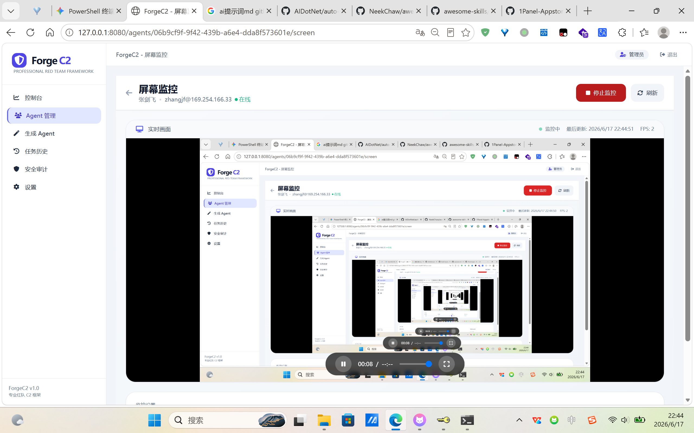
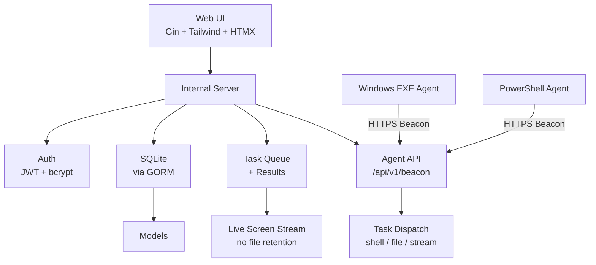

# ForgeC2

[English](./README.md) | [中文](./README.zh.md)

**专业授权红队作战的命令与控制框架**

ForgeC2 是一个基于纯 Go 构建的现代化、单二进制、面向操作员的 C2 框架。它拥有美观的深色主题 Web 界面、两种 Agent 类型（原生 Windows EXE + PowerShell）、实时屏幕流（不落盘）、按需截图（EXE 使用纯 Go）、文件操作以及强大的任务管理功能，专为独立操作员和专业安全团队设计。

## 功能特性

- **美观的现代化 Web UI**（端口 8080）—— 采用 Tailwind + HTMX 的专业深色主题
- **两种 Agent 类型**：
  - 原生 Windows `.exe`（纯 Go，通过 ldflags 注入配置）
  - PowerShell `.ps1`（适合无文件执行）
- **核心能力**：
  - Shell 命令执行（cmd.exe / powershell.exe）
  - 实时屏幕监控（基于流式传输，不保存文件）
  - 按需截图（EXE 采用纯 Go GDI 实现）
  - 文件操作（列目录、读取、删除、上传、下载）
  - 进程列表、终止进程等
- **HTTPS 支持**，支持自动生成自签名证书
- **可配置 TLS 验证**，生成 Agent 时可选择跳过证书验证
- **单用户认证**，使用 bcrypt + JWT
- **SQLite + GORM**
- **WebSocket 实时推送**（任务状态、屏幕画面）
- **Docker 支持**
- **结构清晰**，handlers 已拆分，便于维护和扩展

### 近期改进
- EXE Agent 采用纯 Go 实现截图（不再依赖 PowerShell）
- 实时屏幕监控改为流式传输，不再使用重复截图任务
- 监控结束后自动清理本次产生的占位任务
- 监控期间截图不保存到磁盘
- 任务字段规范化（引入 Path/Data）
- 增强审计日志记录
- 文件传输增加大小限制
- 重构 handlers 并改进 WebSocket 实时推送

## 功能截图

### 仪表盘


### Agent 管理


### 实时屏幕监控（流式）


### Shell 命令执行


### 文件浏览器


### 生成 Agent


## 快速开始

### 1. 编译运行（推荐）

```bash
git clone https://github.com/Ruka-afk/forgec2.git
cd forgec2
go mod tidy
go run ./cmd/server
```

服务默认监听在 **http://0.0.0.0:8080**（可在 config.yaml 中开启 TLS）。

首次访问会提示设置操作员密码。

### 2. 使用 Docker

```bash
docker-compose up --build
```

### 3. 访问 Web UI

在浏览器打开 `http://你的服务器IP:8080`（如果开启 TLS 则使用 https）。实验室环境请接受自签名证书警告。

使用首次运行时设置的密码登录。

## 生成与部署 Agent

### Windows EXE

1. 进入 **Generate Agent** 页面
2. 自定义 C2 地址（使用公网 IP 或域名 + :8080）、心跳间隔、抖动、User-Agent
3. （可选）启用基础持久化
4. 点击 **Generate & Download EXE**
5. 将 `forgec2_agent.exe` 传输到目标 Windows 机器并执行

### PowerShell

生成流程相同，会下载 `.ps1` 文件。可直接运行，或使用 `powershell -ep bypass -f forgec2_agent.ps1` 执行。

两种 Agent 支持相同的 beacon 协议和功能。

## 架构设计



> Mermaid 图表在 GitHub 上会自动渲染。如果无法显示，请尝试刷新页面，或直接查看原始 Markdown 文件。
```
## 配置说明

首次运行会自动生成 `config.yaml`：

```yaml
server:
  port: 8080
  host: 0.0.0.0
  tls_enabled: false
  cert_file: data/server.crt
  key_file: data/server.key
  jwt_secret: <自动生成>
database:
  path: data/db/forgec2.db
agent:
  default_interval: 10
  default_jitter: 20
# ...
```

生成 Agent 时可选择是否跳过 TLS 证书验证（适合使用自签名证书的场景）。

## 完整测试流程（推荐）

1. 在攻击机（Kali / Windows / Docker）启动 ForgeC2 服务
2. 生成 Windows EXE 或 PS1
3. 复制到你拥有的 Windows 10/11 虚拟机或测试主机
4. 运行 Agent → 10~30 秒内应出现在 **Agents** 列表中
5. 点击 **DETAILS** → 发送 `whoami`、`ipconfig` 等命令
6. 使用 **Live Screen Monitor**（流式传输，不保存文件）或请求按需截图
7. 查看 **Task History**（监控相关任务会在停止后自动清理）
8. 添加备注，测试完成后删除 Agent

## 法律免责声明（重要）

**本软件仅用于授权的安全测试、红队演练及教育目的。**

- 在部署任何 Agent 或与任何系统交互前，你必须获得系统所有者的**明确书面授权**。
- 未经授权访问计算机系统在大多数司法管辖区属于犯罪行为（如美国《计算机欺诈与滥用法案》、英国《计算机滥用法》等）。
- ForgeC2 的开发者及贡献者对因使用本工具造成的任何滥用、损害或非法行为**不承担任何责任**。
- 使用本软件即表示你同意自行承担全部责任，并遵守所有适用法律。

**如果你没有获得授权，请勿使用本工具。**

## 商业 / 专业用途

ForgeC2 采用清晰的关注点分离设计（`cmd/`、`internal/server`、`internal/payload`、`internal/db`），便于扩展以下功能：

- Linux / macOS Agent
- 高级文件传输（分块/断点续传）
- EDR 规避模块
- 报告 / 导出功能
- 多用户支持

如需商业授权或定制开发，请联系作者。

## 社区路线图

- [x] EXE Agent 纯 Go 截图
- [x] 流式实时屏幕监控（不保存文件）
- [x] 监控任务自动清理
- [x] 改进 WebSocket 任务推送
- [ ] Linux 植入物
- [ ] Keylogger 模块
- [ ] 更好的分块文件传输
- [ ] 增强持久化选项
- [ ] 多用户 / RBAC 支持

## License

本项目采用面向授权安全专业人士的自定义许可协议。详见 `LICENSE` 文件（或联系作者获取商业许可）。

**为红队社区用❤️构建。**

---

*ForgeC2 — 铸就你的访问权，掌控你的叙事。*