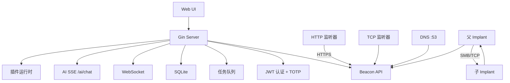

# ForgeC2

[English](./README.md) | [中文](./README.zh.md)

**专业红队作战 C2 框架**

ForgeC2 是一款纯 Go 编写的现代化单二进制 C2 框架，集成完整 Web 控制台、多协议信标、AI 智能助手、插件系统与 50+ Implant 任务类型，适用于授权红队演练与安全研究。

**v2.0.0** — 多语言 · 插件系统 · AI 对话持久化 · Shell 实时模式 · JS 打包 · OpenAPI · TOTP · 加密备份

---

## v2.0.0 更新亮点

| 模块 | 更新内容 |
|------|----------|
| **AI 智能助手** | 全页布局、SSE 流式输出、思考过程展示、切换页面不丢对话、命令即时下发（不等心跳） |
| **Shell** | 0 秒心跳实时模式、中文输出修复、紧凑工具栏 |
| **Web 界面** | 13 个 JS Bundle、暗色模式、全局搜索、通知中心、Implant 上线提醒、虚拟列表 |
| **国际化** | 英语、中文、日语、韩语、阿拉伯语（RTL） |
| **插件** | manifest 驱动，支持 Python/Go，Web UI 管理 |
| **安全** | TOTP 双因素、速率限制、加密数据库备份、配置热重载 |
| **API** | OpenAPI 3.0，访问 `/api/docs` |

---

## 功能

### AI 智能助手
- **多模型**：DeepSeek、OpenAI、Claude、通义千问、自定义 OpenAI 兼容端点
- **函数调用**：列出 Implant、执行命令、查询任务/凭据/监听器/操作员
- **流式输出**：SSE + Markdown 渲染、推理过程、工具调用可视化
- **对话持久化**：历史记录与生成中草稿在切换页面后自动恢复
- **安全限制**：响应长度上限、工具去重、连续调用限制

### C2 核心
- **传输协议**：HTTP(S)、TCP、DNS、ICMP
- **P2P 链式通信**：SMB 命名管道 / TCP 中继
- **可塑配置**：15+ 预设（bing、google、office365、teams 等）
- **多监听器**：每个监听器独立 host/port/profile
- **心跳 + 抖动**：按 Implant 配置，支持 0 秒实时模式

### Implant 能力

| 类别 | 功能 |
|------|------|
| Shell & 系统 | `shell`、`ps`、`killproc`、`suspend`、`resume`、`reboot` |
| 凭据 | `creds`、`mimikatz`、`kerberoast`、`dcsync`、自动入库 |
| 横向移动 | WMI、WinRM、PsExec、Pass-the-Hash、Pass-the-Ticket |
| 令牌 | 窃取、创建、恢复、查询 |
| 执行 | execute-assembly、BOF、PowerPick、PE Loader |
| 持久化 | 注册表、计划任务、启动文件夹、WMI、服务、COM 劫持 |
| 监控 | 截图、键盘记录、实时屏幕流 |
| 网络 | SOCKS5 代理、端口扫描、反向端口转发 |

### Web 控制台
- 仪表盘：图表、热力图、地理分布、攻击路径
- Implant 三态显示（在线 / 超时 / 离线）
- Implant 详情：标签页、端口转发、任务历史、当前窗口标题
- Shell、文件管理、屏幕监控、后渗透工具包（40+ 命令）
- 生成页：跨平台构建、共享监听器、可塑 Profile 锁定
- 全局搜索、操作员聊天、审计日志 CSV 导出
- 可折叠侧边栏、在线用户面板、键盘快捷键

### 插件系统
- 在 `plugins/` 目录放置 `manifest.yaml` 即可注册
- 支持 Python / Go 解释器、超时控制、Agent 端执行
- Web UI：安装、启停、执行、导入导出、评价

### 安全
- JWT + bcrypt、HttpOnly Cookie、CSRF 防护
- TOTP 双因素认证 + 备用码
- 分级速率限制（登录 / API / 信标）
- 审计日志、路径穿越防护
- 密码不写入 HTML DOM
- AES-GCM 加密自动数据库备份

---

## 快速开始

```bash
git clone https://github.com/Ruka-afk/forgec2.git
cd forgec2
go mod tidy
go build -o forgec2-server ./cmd/server
./forgec2-server -config config/config.yaml
```

访问 **http://localhost:8080**，默认账号：`admin` / `admin`

> 将 `config/config.yaml` 复制为项目根目录的 `config.yaml`，或通过 `-config` 指定路径。首次运行会自动创建 `data/` 目录。

### Windows 构建

```powershell
go build -o server.exe ./cmd/server
.\server.exe -config config.yaml
```

### 前端资源打包（可选）

模板通过 `go:embed` 嵌入静态资源。修改 `internal/server/templates/static/` 后需重新打包：

```powershell
powershell -ExecutionPolicy Bypass -File .\build_js.ps1 -SkipCSS
go build -o server.exe ./cmd/server
```

---

## 配置说明

`config.yaml` 主要字段：

```yaml
server:
  port: 8080
  offline_threshold: 60      # 超时判定（秒）
implant:
  default_interval: 0        # 0 = Shell 实时模式
  default_jitter: 20
ai:
  enabled: true
  provider: deepseek
  api_key: "sk-..."
  model: deepseek-chat
rate_limit:
  login:
    max_attempts: 5
    lockout_time: 900
```

完整模板见 `config/config.yaml`。

---

## AI 助手配置

1. 侧边栏打开 **AI 智能助手**
2. 点击 **设置**，启用 AI，选择提供商并填入 API Key
3. 保存后页面自动刷新

AI 下发 Implant 命令后立即返回，**不会阻塞等待心跳回连**。可用自然语言或快捷按钮管理演练环境。

---

## API 文档

交互式文档：**http://localhost:8080/api/docs**

OpenAPI 规范：`api/openapi.yaml`（同时挂载在 `/api/docs/openapi.yaml`）

通过 `POST /login` 获取会话 Cookie（`forgec2_session`）后调用 API。

---

## 项目结构

```
forgec2/
├── cmd/server/          # 服务端入口
├── cmd/i18n-tool/       # 翻译管理 CLI
├── internal/
│   ├── server/          # HTTP 处理器、模板、WebSocket、AI
│   ├── payload/agent/   # Implant 源码（Windows / Linux）
│   ├── plugin/          # 插件运行时
│   ├── db/              # GORM 模型 + SQLite
│   └── malleable/       # 可塑 C2 配置引擎
├── api/openapi.yaml     # REST API 规范
├── plugins/             # 插件目录
├── build_js.ps1         # JS/CSS 打包脚本
└── config/config.yaml   # 配置模板
```

---

## 架构



---

## 开发

```bash
# 运行测试
go test ./...

# 翻译检查
go run ./cmd/i18n-tool check --lang zh

# 开发模式（不打包 JS，设置 FORGEC2_DEV=1）
FORGEC2_DEV=1 go run ./cmd/server -config config.yaml
```

### Agent Skills（OpenCode）

工作流技能位于 `.opencode/skills/`：

- `add-task-type` — 端到端添加新任务类型
- `plugin-task` — JSON 自定义任务插件
- `websocket-event` — WebSocket 实时事件
- `report-section` — 报告生成器章节

---

## 路线图

- [x] HTTP/HTTPS/TCP/DNS/ICMP 传输 · P2P 链式通信
- [x] Artifact Kit · 可塑配置 · SOCKS5
- [x] 多用户 RBAC · 协作 · AI 助手
- [x] 国际化 · 插件 · OpenAPI · TOTP · 备份
- [x] JS 打包 · 全局搜索 · 通知中心
- [x] Shell 实时模式 · AI 对话持久化
- [ ] macOS Implant · EDR 规避

---

## 法律声明

**仅限授权的安全测试使用。** 部署前须获得目标系统的明确书面授权。详见 [LICENSE](./LICENSE)。

---

*ForgeC2 — 铸就访问，掌控叙事。*