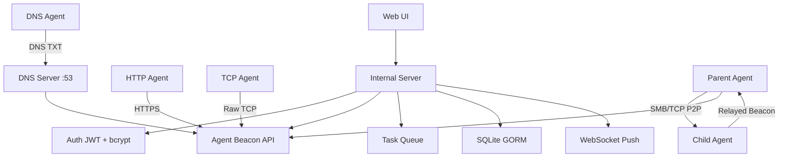

# ForgeC2

[English](./README.md) | [中文](./README.zh.md)

**专业授权红队作战的命令与控制框架**

ForgeC2 是一个基于纯 Go 构建的现代化、单二进制、面向操作员的 C2 框架。支持 P2P 信标链式通信（SMB/TCP）、DNS 信标、Artifact Kit（stager/stage）、凭据收集、50+ 任务类型、实时屏幕流以及美观的深色主题 Web 界面 —— 专为独立操作员和专业红队设计。


## 功能特性

### 🏗️ 核心 C2
- **两种传输层**：HTTP(S) 和 TCP（原始长度前缀帧）
- **DNS 信标**：通过 UDP DNS TXT 查询实现隐蔽出口通信
- **P2P 信标链**：SMB 命名管道（Windows）/ Unix 套接字（Linux）和 TCP 中继 — Agent 形成父子拓扑
- **可塑 C2 轮廓**：可配置 HTTP 响应头、Cookie、User-Agent、信标 URI、HTTP 方法（GET/POST）
- **多监听器支持**：HTTP、HTTPS、TCP 监听器，独立配置
- **可配置休眠/抖动**：每个 Agent 独立设置，支持运行时 `set_sleep`

### 🎨 Artifact Kit
- **Stage**：完整的信标 EXE，经 XOR + base64 编码，通过 `GET /stage/:xorKey` 分发
- **Stager**：最小化 Go 二进制（仅 stdlib），从 C2 获取 stage、解码、写入临时文件并执行
- **Linux stager**：ELF 版本 stager
- **所有 stage/文件端点均有路径穿越防护**

### 🧠 Agent 能力（50+ 任务类型）
| 类别 | 任务 |
|----------|-------|
| **Shell & 系统** | `shell`、`ps`、`killproc`、`suspend`、`resume`、`reboot`、`shutdown`、`services`、`drives`、`users`、`av`、`netstat`、`portscan` |
| **文件操作** | `ls`、`read`、`delete`、`upload`、`download`、`download_url`、`find` |
| **凭据** | `creds`（SAM/SYSTEM/LSASS 转储）、`mimikatz`（通过 PowerShell）、`kerberoast`（通过 .NET）、自动导入凭据库 |
| **横向移动** | `lateral`（WMI、WinRM、类 PsExec via schtasks）、`inject`（CreateRemoteThread、APC、EarlyBird） |
| **令牌操作** | `token_list_procs`、`token_steal`、`token_make`、`token_revert`/`rev2self`、`token_whoami` |
| **权限提升** | `elevate`（UAC 绕过）、`elevate_printnightmare` |
| **执行** | `execute_assembly`（.NET via PowerShell）、`bof`（COFF 加载器，含 Beacon API 存根） |
| **持久化** | `persist`（HKCU Run、schtasks、启动文件夹）、`uninstall` |
| **监控** | `screenshot`（全屏）、`screenshot_window`、`keylogger_start`/`stop`/`dump`、屏幕实时流 |
| **网络** | `portscan`、`socks`（通过 C2 中继的 SOCKS5 代理）、`download_url` |
| **其他** | `beacon_now`、`set_sleep`、`kill_av`、剪贴板读写、注册表操作、`kill` Agent |

### 🖥️ Web UI（Gin + HTMX + Tailwind CSS）
- **仪表盘**：活跃 Agent 数、任务吞吐量、最近活动
- **Agent 详情页**：完整信息、备注/标签、父子拓扑图
- **Shell 界面**：实时命令执行与输出显示
- **文件浏览器**：导航、上传、下载、删除 Agent 文件
- **实时屏幕监控**：流式传输、零磁盘留存、WebSocket 推送
- **任务历史**：可排序、可过滤、带结果预览
- **审计日志**：完整操作日志，含 IP 追踪
- **凭据库**：mimikatz/kerberoast 自动采集的凭据
- **令牌库**：窃取/创建的令牌，含完整性级别显示
- **Agent 拓扑图**：P2P 父子关系可视化
- **设置页面**：监听器 CRUD、用户管理、配置

### 🔒 安全加固
- **JWT + bcrypt 认证**，含会话管理
- **CSRF 防护**，覆盖所有状态变更路由
- **速率限制**，基于客户端 IP
- **审计日志**，覆盖所有敏感操作
- **路径穿越防护**（所有文件路径使用 `safeJoin`）
- **安全 Cookie 标记**（SameSite=Strict、TLS 时 Secure、HttpOnly）
- **目录权限**：cert/db/config 目录 0700，文件 0600
- **WebSocket 保活**（ping/pong + 30s 定时器 + 60s 读取截止）
- **输入消毒**（搜索/用户输入的 XSS 转义）
- **配置下载时遮盖 JWT 密钥**

### 🧩 数据库
- **SQLite via GORM**，自动迁移
- **索引外键**，支撑大规模查询性能
- **模型**：Agent、Task、CredentialEntry、TokenEntry、SocksSession、AuditLog、Listener、User、BeaconHistory
- **批量插入**（每批 50 条），带去重
- **流式数据库备份** via `io.Copy`

## 快速开始

### 1. 编译运行（推荐）

```bash
git clone https://github.com/Ruka-afk/forgec2.git
cd forgec2
go mod tidy
go run ./cmd/server
```

服务默认监听在 **http://0.0.0.0:8080**（可在 config.yaml 中开启 TLS）。

首次访问会提示设置操作员密码。

### 2. 使用 Docker

```bash
docker-compose up --build
```

### 3. 生成与部署 Agent

1. 进入 **Generate** 页面
2. 设置 C2 地址、心跳间隔、抖动、User-Agent
3. 选择 Artifact Kit stager（Windows EXE）或 PowerShell
4. 部署并等待上线 —— Agent 在 10-30 秒内出现

## 架构设计



## Agent 生成与 Artifact Kit

### 载荷类型
| 类型 | 格式 | 构建方式 |
|------|--------|-------------|
| 原生 EXE | PE (Windows) | `go build` with ldflags |
| Stager (Windows) | 最小 PE | 仅 stdlib，下载 stage |
| Stager (Linux) | ELF | 仅 stdlib，下载 stage |
| Stage | 编码 EXE | XOR + base64，HTTP 分发 |
| PowerShell | .ps1 | PowerShell 模板嵌入配置 |

### Stage 流程
1. 操作员生成 stage（每次生成随机 XOR 密钥）
2. Stage 存储为 `data/agents/stage_<xorKeyHex>.enc`
3. Stager 请求 `GET /stage/:xorKey`
4. Stager 解码（base64 → XOR）并从临时文件执行

## P2P 信标链

ForgeC2 支持父子 Agent 拓扑，适用于网络隔离环境：

- **SMB 模式**：Windows 命名管道（`\\.\pipe\name`）via `go-winio`；Linux Unix 套接字（`/tmp/name`）
- **TCP 模式**：Agent 间原始 TCP 连接
- **自动中继**：子节点结果通过父节点转发到 C2；服务端通过父节点向子节点分发任务
- **子节点清理**：10 分钟无活动后自动清理 UUID

## DNS 信标

- UDP DNS 服务器监听 `:53`
- Agent 查询 `<uuid>.beacon.c2domain` 的 TXT 记录
- 响应包含 base64 编码的 JSON 信标数据
- 需要管理员/root 权限绑定特权端口

## 安全审计与修复

代码库已完成全面安全审计，修复 12 项问题：

- 配置密钥遮盖（JWT、密码哈希）
- 路径穿越防护（`safeJoin`）
- XSS 消毒（`template.HTMLEscapeString`）
- WS 锁竞争修复（基于快照的广播）
- 上传大小限制（MaxUploadSize=50MB）
- Cookie Secure 标记（TLS 时启用）
- 速率限制 IP 伪造修复（仅用 socket IP）
- 目录/文件权限强化（0700/0600）
- WS 保活（ping/pong + 截止时间）
- DB 备份流式化（io.Copy）
- 凭据批量插入（CreateInBatches）
- 全局状态 → Server 结构体重构（screenMonitorAgents）

## 法律免责声明（重要）

**本软件仅用于授权的安全测试、红队演练及教育目的。**

- 在部署任何 Agent 前，你必须获得系统所有者的**明确书面授权**。
- 未经授权访问计算机系统在大多数司法管辖区属于犯罪行为。
- 开发者对因使用本工具造成的任何滥用、损害或非法行为**不承担任何责任**。
- 使用本软件即表示你同意自行承担全部责任，并遵守所有适用法律。

**如果你没有获得授权，请勿使用本工具。**

## 社区路线图

- [x] EXE Agent 纯 Go 截图
- [x] 流式实时屏幕监控（零磁盘留存）
- [x] TCP 传输层
- [x] Linux Agent（基础：shell/ps/ls/文件）
- [x] Keylogger（Windows GetAsyncKeyState）
- [x] 进程暂停/恢复
- [x] SOCKS5 中继代理
- [x] P2P 信标链（SMB/TCP）
- [x] DNS 信标
- [x] Artifact Kit（stager/stage）
- [x] 凭据自动导入（mimikatz/kerberoast）
- [x] Execute-assembly & BOF 加载器
- [x] 令牌操作（窃取/创建/恢复/查询）
- [x] 可塑 C2 轮廓
- [x] 多监听器支持
- [x] 安全审计（12 项修复）
- [ ] 增强持久化选项
- [x] 多用户 / RBAC（admin/operator/viewer 角色）
- [x] 多用户协作（聊天、在线状态、Agent 锁定）
- [x] 全局搜索（Agent / 任务 / 监听器）
- [x] CDN 无关性 —— Tailwind CDN 被屏蔽时 CSS 降级
- [ ] macOS Agent
- [ ] EDR 规避模块

## License

本项目采用面向授权安全专业人士的自定义许可协议。详见 `LICENSE` 文件（或联系作者获取商业许可）。

---

*ForgeC2 — 铸就你的访问权，掌控你的叙事。*
